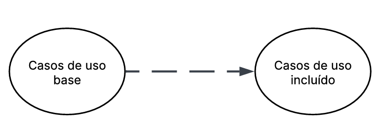

# Casos de Uso

## Descrição
Os casos de uso descrevem como o usuário interage com o sistema para realizar determinadas tarefas ou atingir objetivos específicos. Eles representam os diferentes cenários de uso, mostrando as ações do usuário e as respostas do sistema em cada situação. Essa técnica ajuda a compreender melhor o comportamento esperado da aplicação e garante que todos os requisitos funcionais sejam identificados e documentados de forma clara.

## Objetivo
O objetivo dos casos de uso é detalhar o funcionamento do sistema a partir da perspectiva do usuário, facilitando o entendimento entre desenvolvedores, analistas e stakeholders. Com eles, é possível visualizar os principais fluxos de interação, identificar possíveis falhas ou melhorias e assegurar que o sistema atenda às necessidades reais dos usuários e aos requisitos definidos no projeto.

## Metodologia

### **Tabela 1:** Elementos do diagrama de casos de uso
| Nome         | Função                     | Elemento                          |
|--------------|----------------------------|-----------------------------------|
| Sistema      | Representado por um retangulo o sistema define os limites do sistema, indicando o que está dentro do seu escopo e o que está fora representando o conjunto de funcionalidades que serão modeladas    |   |
| Atores       | Representado por bonecos palito os atores representam os usuários, pessoas ou outros sistemas que interagem com o sistema principal, executando ações ou recebendo respostas      |     |
| Casos de Uso      | Repesentado por uma forma geometrica oval os casos de uso descrevem as funcionalidades ou serviços que o sistema oferece aos atores sendo que cada caso de uso representa um objetivo ou tarefa que o usuário pode realizar |  |
| Relacionamento de Associação | Representado por uma linha contínua o relacionamento de associação mostra a ligação direta entre um ator e um caso de uso, indicando que o ator participa daquela funcionalidade|  |
| Relacionamento de Inclusão| Representado por uma linha tracejada ligando um caso de uso base até um caso de uso incluído com uma seta no final. O relacionamento de inclusão indica que um caso de uso inclui obrigatoriamente outro caso de uso em seu fluxo normal de execução|  |
| Relacionamento de Extensão | Representado por uma linha tracejada ligando um caso de uso estendido até um caso de uso base com uma seta no final. O relacionamento de extensão representa comportamentos opcionais ou condicionais, que ocorrem apenas em determinadas situações dentro de um caso de uso |   |
| Relacionamento de Generalização | Representado por uma seta contínua ligando o caso de uso especializado ao caso de uso geral, com um triângulo na ponta voltado para o caso de uso geral. O relacionamento de generalização mostra a herança entre atores ou casos de uso, quando um elemento herda características ou comportamentos de outro |    |

#### **#### **Fonte :**** [Guilherme](https://github.com/GuilhermeOliveira1327), 2025

## Conteúdo
### Diagrama de Casos de Uso
A figura 1 demonstra o diagrama de casos de uso.

Figura 1: Casos de uso do app LigaMagic

[Link para o lucidchart](https://lucid.app/lucidchart/c773e26a-b84b-417d-94ac-0650750fad93/edit?invitationId=inv_fe5546f1-416e-4628-be7c-b75e4a0fbf4c&page=0_0#)
#### **Fonte:** Angélica e [Guilherme](https://github.com/GuilhermeOliveira1327), 2025

### Especialização dos casos de uso
#### Tabela 2: Configurar Período de Retenção de Dados

| Campo                      | Descrição                                                                                                   |
| :------------------------- | :---------------------------------------------------------------------------------------------------------- |
| **Identificador:**         | UC01                                                                                                    |
| **Nome:**                  | Configurar Período de Retenção de Dados                                                          |
| **Atores:**                | Administrador do sistema                                                           |
| **Descrição:**             | O sistema deve permitir configurar e visualizar o tempo de retenção dos dados pessoais conforme base legal. |
| **Pré-condições:**         | O usuário deve estar autenticado.                                                                           |
| **Fluxo principal:**       | Passos do ator e do sistema em condições normais.                                                           |
| **Fluxos alternativos:**   | O que acontece se algo der errado (ex: dados inválidos, falha de permissão).                                |
| **Pós-condição:**          | O sistema registra o tempo de retenção e atualiza a política.                                               |
| **Requisitos associados:** | **NI01** – Armazenamento e Retenção                                                                             |

**Fonte:** Angélica 

#### Tabela 3: Registrar Incidente de Segurança

| Campo                      | Descrição                                                                                                   |
| :------------------------- | :---------------------------------------------------------------------------------------------------------- |
| **Identificador:**         | UC02                                                                                                   |
| **Nome:**                  | Registrar Incidente de Segurança                                                          |
| **Atores:**                | Administrador do sistema                                                           |
| **Descrição:**             | Permite o registro, documentação e gerenciamento de incidentes de segurança envolvendo dados pessoais. |
| **Pré-condições:**         | O usuário deve estar autenticado.                                                                           |
| **Fluxo principal:**       | Passos do ator e do sistema em condições normais.                                                           |
| **Fluxos alternativos:**   | Sistema identifica gravidade CRÍTICA (>10.000 usuários ou dados sensíveis).                                |
| **Pós-condição:**          | Incidente registrado com número de protocolo único.                                               |
| **Requisitos associados:** | **NI02** - Procedimento para Incidentes                                                                             |

**Fonte:** Angélica 

### Tabela 4 - Especificação do Caso de Uso: Personalizar Perfil de  Jogador

| Campo| Descrição |
| :--- | :--- |
| **UC03** | **Personalizar Perfil de  Jogador** |
| **Descrição** | Este caso de uso descreve como o jogador realiza a atualização de suas informações pessoais, como avatar e endereço de envio, em seu perfil na plataforma. |
| **Atores** |  Jogador Comum (ator principal), Sistema |
| **Pré-condição** | O jogador deve estar autenticado (logado) no sistema. |
| **Pós-condição** | As informações do perfil do jogador são atualizadas e armazenadas no sistema. A alteração é refletida imediatamente na plataforma. |
| **Fluxo principal** | 1. O jogador acessa a área "Meu Perfil". O sistema exibe as informações atuais do perfil e as opções de edição. O jogador seleciona um campo para editar (ex: Avatar, Endereço). O sistema apresenta a interface de edição para o campo selecionado. O jogador insere as novas informações (ex: faz upload de imagem, preenche novo CEP). O jogador aciona a opção para salvar a alteração. O sistema valida os dados inseridos. O sistema registra a alteração e apresenta a confirmação ao jogador, atualizando a tela de perfil. |
| **Fluxo alternativo** | - 6a. O jogador decide cancelar a edição: o sistema descarta as alterações e retorna à tela de visualização do perfil. |
| **Fluxo de exceções** | - E1. Falha no upload da imagem (formato/tamanho inválido): o sistema exibe uma mensagem de erro e solicita um novo arquivo.E2. Dados obrigatórios não preenchidos (ex: rua em um endereço): o sistema alerta sobre o campo e impede o salvamento.E3. Falha de conexão com o sistema: o sistema exibe uma mensagem de erro e informa que a alteração não pôde ser salva. |

###Caso de Uso: Personalizar Perfil de  Jogador

**Fonte:** Marcelo

### Tabela 5 - Especificação do Caso de Uso: Filtrar Busca por Condição

| Campo | Descrição |
| :--- | :--- |
| **UC04** | **Filtrar Busca por Condição** |
| **Descrição** | Este caso de uso descreve como o jogador refina uma lista de resultados de busca de cartas, aplicando um filtro baseado na qualidade/condição de conservação  do item. |
| **Atores** |  Jogador Comum (ator principal), Vendedor (ator principal), Sistema |
| **Pré-condição** | O jogador deve ter realizado uma busca e estar na página de resultados. |
| **Pós-condição** | A lista de resultados é atualizada para exibir apenas os itens que correspondem ao critério de condição selecionado pelo jogador. |
| **Fluxo principal** | 1. O jogador aciona a opção "Filtros". O sistema exibe as categorias de filtro disponíveis. O jogador seleciona a categoria "Condição". O sistema exibe as opções de condição (ex: Near Mint, Slightly Played, etc.). O jogador seleciona uma ou mais condições desejadas. O jogador confirma a aplicação do filtro. O sistema processa a requisição e atualiza a lista de resultados na tela. |
| **Fluxo alternativo** | - 6a. O jogador decide limpar um filtro selecionado: o sistema desmarca a opção.6b. O jogador decide fechar a janela de filtros sem aplicar: o sistema retorna à página de resultados sem realizar alterações. |
| **Fluxo de exceções** | - E1. Nenhum resultado corresponde ao filtro: o sistema exibe uma mensagem "Nenhum resultado encontrado para os filtros aplicados" e sugere a remoção do filtro.E2. Falha de conexão com o sistema ao aplicar o filtro: o sistema exibe uma mensagem de erro e mantém a busca original. |

###Caso de Uso: Filtrar Busca por Condição

**Fonte:** Marcelo
### Diagrama de Casos de Uso
A figura 1 demonstra o diagrama de casos de uso.

Figura 1: Casos de uso do app LigaMagic

[Link para o lucidchart](https://lucid.app/lucidchart/c773e26a-b84b-417d-94ac-0650750fad93/edit?invitationId=inv_fe5546f1-416e-4628-be7c-b75e4a0fbf4c&page=0_0#)
#### **Fonte:** Angélica e [Guilherme](https://github.com/GuilhermeOliveira1327), 2025

### Especialização dos casos de uso
#### Tabela 2: Configurar Período de Retenção de Dados

| Campo                      | Descrição                                                                                                   |
| :------------------------- | :---------------------------------------------------------------------------------------------------------- |
| **Identificador:**         | UC01                                                                                                    |
| **Nome:**                  | Configurar Período de Retenção de Dados                                                          |
| **Atores:**                | Administrador do sistema                                                           |
| **Descrição:**             | O sistema deve permitir configurar e visualizar o tempo de retenção dos dados pessoais conforme base legal. |
| **Pré-condições:**         | O usuário deve estar autenticado.                                                                           |
| **Fluxo principal:**       | Passos do ator e do sistema em condições normais.                                                           |
| **Fluxos alternativos:**   | O que acontece se algo der errado (ex: dados inválidos, falha de permissão).                                |
| **Pós-condição:**          | O sistema registra o tempo de retenção e atualiza a política.                                               |
| **Requisitos associados:** | **NI01** – Armazenamento e Retenção                                                                             |

**Fonte:** Angélica 

#### Tabela 3: Registrar Incidente de Segurança

| Campo                      | Descrição                                                                                                   |
| :------------------------- | :---------------------------------------------------------------------------------------------------------- |
| **Identificador:**         | UC02                                                                                                   |
| **Nome:**                  | Registrar Incidente de Segurança                                                          |
| **Atores:**                | Administrador do sistema                                                           |
| **Descrição:**             | Permite o registro, documentação e gerenciamento de incidentes de segurança envolvendo dados pessoais. |
| **Pré-condições:**         | O usuário deve estar autenticado.                                                                           |
| **Fluxo principal:**       | Passos do ator e do sistema em condições normais.                                                           |
| **Fluxos alternativos:**   | Sistema identifica gravidade CRÍTICA (>10.000 usuários ou dados sensíveis).                                |
| **Pós-condição:**          | Incidente registrado com número de protocolo único.                                               |
| **Requisitos associados:** | **NI02** - Procedimento para Incidentes                                                                             |

**Fonte:** Angélica 

## Bibliografia
> 1. LUCID SOFTWARE PORTUGUÊS. Tutorial de Caso de Uso UML. YouTube, 20 mar. 2020. Disponível em: [Vídeo Completo](https://www.youtube.com/watch?v=ab6eDdwS3rA). Acesso em: 07 out. 2025. 

## Nível de Contribuição dos Integrantes

| Nome | % de Contribuição |
| :--- | :---------------: |
|   [Guilherme](https://github.com/GuilhermeOliveira1327)    |                   |
|   [Angélica](https://github.com/angelicaccampos)    |                   |
|   Marcelo           |             |

## Histórico de versão

| Versão | Data | Descrição | Autor(es) | Revisor |
| :----: | :--: | :-------- | :-------: | :-----: |
|   1.0  |  07/10/2025   | Adição da Descrição, objetivo e metodologia | [Guilherme](https://github.com/GuilhermeOliveira1327)|[Angélica](https://github.com/angelicaccampos) |
|   1.1  | 09/102025| Adição de casos de usos: filtrar por condição e personalizar perfil do jogador| Marcelo |                 |