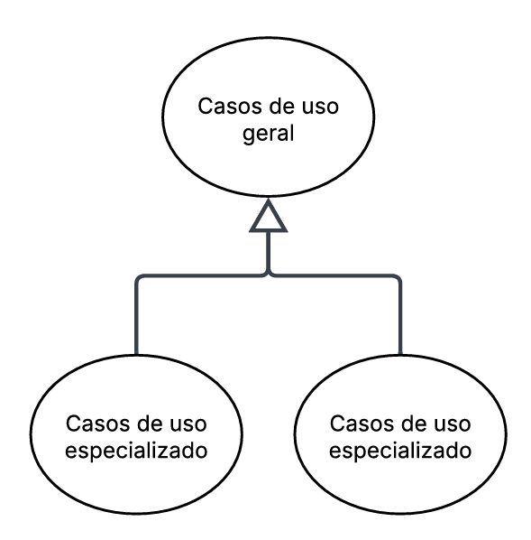

# Casos de Uso

## Descrição
Os casos de uso descrevem como o usuário interage com o sistema para realizar determinadas tarefas ou atingir objetivos específicos. Eles representam os diferentes cenários de uso, mostrando as ações do usuário e as respostas do sistema em cada situação. Essa técnica ajuda a compreender melhor o comportamento esperado da aplicação e garante que todos os requisitos funcionais sejam identificados e documentados de forma clara.

## Objetivo
O objetivo dos casos de uso é detalhar o funcionamento do sistema a partir da perspectiva do usuário, facilitando o entendimento entre desenvolvedores, analistas e stakeholders. Com eles, é possível visualizar os principais fluxos de interação, identificar possíveis falhas ou melhorias e assegurar que o sistema atenda às necessidades reais dos usuários e aos requisitos definidos no projeto.

## Metodologia

### **Tabela 1:** Elementos do diagrama de casos de uso
| Nome         | Função                     | Elemento                          |
|--------------|----------------------------|-----------------------------------|
| Sistema      | Representado por um retangulo o sistema define os limites do sistema, indicando o que está dentro do seu escopo e o que está fora representando o conjunto de funcionalidades que serão modeladas    |   |
| Atores       | Representado por bonecos palito os atores representam os usuários, pessoas ou outros sistemas que interagem com o sistema principal, executando ações ou recebendo respostas      |     |
| Casos de Uso      | Repesentado por uma forma geometrica oval os casos de uso descrevem as funcionalidades ou serviços que o sistema oferece aos atores sendo que cada caso de uso representa um objetivo ou tarefa que o usuário pode realizar |  |
| Relacionamento de Associação | Representado por uma linha contínua o relacionamento de associação mostra a ligação direta entre um ator e um caso de uso, indicando que o ator participa daquela funcionalidade|  |
| Relacionamento de Inclusão| Representado por uma linha tracejada ligando um caso de uso base até um caso de uso incluído com uma seta no final. O relacionamento de inclusão indica que um caso de uso inclui obrigatoriamente outro caso de uso em seu fluxo normal de execução|  |
| Relacionamento de Extensão | Representado por uma linha tracejada ligando um caso de uso estendido até um caso de uso base com uma seta no final. O relacionamento de extensão representa comportamentos opcionais ou condicionais, que ocorrem apenas em determinadas situações dentro de um caso de uso |   |
| Relacionamento de Generalização | Representado por uma seta contínua ligando o caso de uso especializado ao caso de uso geral, com um triângulo na ponta voltado para o caso de uso geral. O relacionamento de generalização mostra a herança entre atores ou casos de uso, quando um elemento herda características ou comportamentos de outro |    |

#### **Fonte :** [Guilherme](https://github.com/GuilhermeOliveira1327), 2025

## Conteúdo

### Diagrama de Casos de Uso
A figura 1 demonstra o diagrama de casos de uso.

Figura 1: Casos de uso do app LigaMagic

#### **Fonte:** Angélica, Vera e [Guilherme](https://github.com/GuilhermeOliveira1327), 2025

### PDFs com Diagrama de casos de Uso

[Diagrama de caso de uso Casos de uso do app LigaMagic disponivel em PDF.](../../00_assets/pdfs/DiagramaGeral1.pdf)

[Diagrama de caso de uso: Definir Alerta de Preço para uma Carta (PDF)](../../00_assets/pdfs/Diagrama1.pdf)

[Diagrama de caso de uso: Reportar Erro em Carta ou Anúncio    (PDF)](../../00_assets/pdfs/Diagrama.pdf)

### Especialização dos casos de uso
#### Caso de uso 01 - Wishlist de Cartas    
| Campo                      |Descrição                                                                                                    |
| :------------------------- | :---------------------------------------------------------------------------------------------------------- |
| **Identificador:**         | UC01                  |
| **Nome:**                  |   Wishlist de Cartas|
| **Atores:**                |   Usuário     |
| **Descrição:**             |Usuário adiciona carta à lista de desejos para compra futura.|
| **Objetivo:**              |Salvar carta para compra futura. |
| **Ação:**                  |Adicionar item à lista pessoal de desejos.|
| **Pré-condições:**         |    • Usuário autenticado no sistema • Carta disponível no catálogo                                                    |
| **Pós-condição:**          |    • Carta adicionada à wishlist do usuário • Contador de itens atualizado • Dados sincronizados no servidor                    |
| **Fluxo principal:**       |  1. Usuário visualiza carta na lista de resultados ou tela de detalhes da carta 2. Clica no ícone "Adicionar à Wishlist"     3. Sistema valida sessão e disponibilidade                4. Sistema adiciona carta à wishlist do usuário         5. Sistema exibe feedback visual de confirmação 6. Sistema atualiza contador na interface  |
| **Fluxos alternativos:**   |   • Sistema detecta duplicata • Exibe "Já na sua wishlist" • Oferece opção de remove   |
| **Fluxos de exceção:**     |   • Sistema detecta token inválido • Redireciona para tela de login • Mantém contexto da carta para retorno        |
| **Rastreabilidade** | RI14 |
| **Data de criação** | 10/10/2025 |
| **Autoria**         | Angélica |

**Fonte:** Angélica 

#### Caso de uso 02 - Pesquisar Cartas
| Campo                      | Descrição                                                                                                   |
| :------------------------- | :---------------------------------------------------------------------------------------------------------- |
| **Identificador:**         | UC02                                                                                                   |
| **Nome:**                  |    Pesquisar Cartas                               |
| **Atores:**                |   Usuário                              |
| **Descrição:**             |  Usuário busca cartas por nome, tipo ou categoria.|
| **Objetivo:**              |Encontrar cartas específicas rapidamente para consulta ou compra|
| **Ação:**                  | Realizar busca no catálogo de cartas|
| **Pré-condições:**         |  • Aplicativo conectado à internet • Serviço de busca disponível • Catálogo de cartas carregado                                                      |
| **Fluxo principal:**       |   1. Usuário acessa aba de pesquisa 2. Digita termo de busca (nome, tipo ou categoria) 3. Sistema valida entrada e envia requisição 4. Sistema processa busca e filtra resultados 5. Sistema exibe lista de cartas correspondentes 6. Usuário visualiza e navega pelos resultados                                  |
| **Fluxos alternativos:**   | • Usuário aplica filtros antes da busca • Sistema combina termo com filtros aplicados • Retorna resultados refinados           |
| **Pós-condição:**          |  • Resultados da pesquisa exibidos na tela • Histórico de busca atualizado • Usuário pode selecionar cartas para detalhes                    |
| **Fluxos de exceção:**     |• Sistema não encontra correspondências • Exibe "Nenhuma carta encontrada" • Sugere termos similares ou categorias|
| **Rastreabilidade** | RI15 |
| **Data de criação** | 10/10/2025 |
| **Autoria**       | Angélica |

**Fonte:** Angélica 

#### Caso de uso 03 - Personalizar Perfil de  Jogador
| Campo| Descrição |
| :--- | :--- |
| **UC03** | **Personalizar Perfil de  Jogador** |
| **Descrição** | Este caso de uso descreve como o jogador realiza a atualização de suas informações pessoais, como avatar e endereço de envio, em seu perfil na plataforma. |
| **Atores** |  Jogador Comum (ator principal), Sistema |
| **Pré-condição** | O jogador deve estar autenticado (logado) no sistema. |
| **Pós-condição** | As informações do perfil do jogador são atualizadas e armazenadas no sistema. A alteração é refletida imediatamente na plataforma. |
| **Fluxo principal** | 1. O jogador acessa a área "Meu Perfil". O sistema exibe as informações atuais do perfil e as opções de edição. O jogador seleciona um campo para editar (ex: Avatar, Endereço). O sistema apresenta a interface de edição para o campo selecionado. O jogador insere as novas informações (ex: faz upload de imagem, preenche novo CEP). O jogador aciona a opção para salvar a alteração. O sistema valida os dados inseridos. O sistema registra a alteração e apresenta a confirmação ao jogador, atualizando a tela de perfil. |
| **Fluxo alternativo** | - 6a. O jogador decide cancelar a edição: o sistema descarta as alterações e retorna à tela de visualização do perfil. |
| **Fluxo de exceções** | - E1. Falha no upload da imagem (formato/tamanho inválido): o sistema exibe uma mensagem de erro e solicita um novo arquivo.E2. Dados obrigatórios não preenchidos (ex: rua em um endereço): o sistema alerta sobre o campo e impede o salvamento.E3. Falha de conexão com o sistema: o sistema exibe uma mensagem de erro e informa que a alteração não pôde ser salva. |

**Fonte:** Marcelo

#### Caso de uso 04 - Especificação do Caso de Uso: Filtrar Busca por Condição
| Campo | Descrição |
| :--- | :--- |
| **UC04** | **Filtrar Busca por Condição** |
| **Descrição** | Este caso de uso descreve como o jogador refina uma lista de resultados de busca de cartas, aplicando um filtro baseado na qualidade/condição de conservação  do item. |
| **Atores** |  Jogador Comum (ator principal), Vendedor (ator principal), Sistema |
| **Pré-condição** | O jogador deve ter realizado uma busca e estar na página de resultados. |
| **Pós-condição** | A lista de resultados é atualizada para exibir apenas os itens que correspondem ao critério de condição selecionado pelo jogador. |
| **Fluxo principal** | 1. O jogador aciona a opção "Filtros". O sistema exibe as categorias de filtro disponíveis. O jogador seleciona a categoria "Condição". O sistema exibe as opções de condição (ex: Near Mint, Slightly Played, etc.). O jogador seleciona uma ou mais condições desejadas. O jogador confirma a aplicação do filtro. O sistema processa a requisição e atualiza a lista de resultados na tela. |
| **Fluxo alternativo** | - 6a. O jogador decide limpar um filtro selecionado: o sistema desmarca a opção.6b. O jogador decide fechar a janela de filtros sem aplicar: o sistema retorna à página de resultados sem realizar alterações. |
| **Fluxo de exceções** | - E1. Nenhum resultado corresponde ao filtro: o sistema exibe uma mensagem "Nenhum resultado encontrado para os filtros aplicados" e sugere a remoção do filtro.E2. Falha de conexão com o sistema ao aplicar o filtro: o sistema exibe uma mensagem de erro e mantém a busca original. |

**Fonte:** Marcelo

#### Caso de uso 09 – Gerenciamento de Listas de Decks  
**Requisito Associado:** RI09 – Os usuários devem ser capazes de criar, salvar e gerenciar listas de decks.  
| **Campo**        | **Descrição** |
| ---------------- | ------------- |
| **UC09**         | Gerenciamento de Listas de Decks |
| **Descrição**    | O sistema permite que o jogador crie, edite, salve e gerencie listas de decks de forma personalizada. |
| **Ator**         | - Jogador - Sistema |
| **Pré-condições**| 1. O jogador deve estar autenticado no sistema. 2. O sistema deve estar com banco de dados acessível. |
| **Ação**         | O jogador cria e gerencia suas listas de decks através da interface do sistema. |
| **Fluxo principal** | - O jogador acessa a área de gerenciamento de decks. - Cria uma nova lista de deck. - Salva alterações realizadas. - Consulta ou edita decks existentes. |
| **Fluxo alternativo** | - O jogador tenta criar uma lista já existente. - O sistema solicita confirmação de sobreposição ou bloqueia duplicatas. |
| **Fluxo de exceção** | - Falha ao salvar lista no banco de dados. - Conexão interrompida durante a operação. |
| **Pós-condições** | A lista de decks do jogadoré salva e pode ser consultada e gerenciada futuramente. |
| **Rastreabilidade** | RI09 |
| **Data de criação** | 08/10/2025 |
| **Autoria**       | Raissa Andrade |

**Fonte:** Raissa, 2025 

#### Caso de uso 10 -  Requisito Associad  RI05 - Definir Alerta de Preço para uma Carta
| **Campo**                  | **Descrição** |
| :---------------- | ------------- |
| **Identificador:**         | UC10 |
| **Nome:**                  | Definir Alerta de Preço para uma Carta|
| **Atores:**                | Conta autenticada |
| **Descrição:**             | Permite criar uma notificação automática para ser avisado quando o preço de uma carta específica atingir um valor desejado.  |
| **Pré-condições:**         | - A conta está autenticada no sistema. - A página de detalhes da carta desejada está aberta. |
| **Fluxo principal:**       | 1. O botão "Criar Alerta de Preço" é clicado na página da carta. 2. O sistema exibe um formulário (modal) com os campos: Condição (ex: "Preço abaixo de", "Preço acima de") e Valor (R$). 3. A condição desejada é selecionada. 4. Um valor de preço válido é inserido. 5. O botão "Salvar Alerta" é clicado. 6. O sistema valida os dados inseridos. 7. O sistema cria o registro do alerta de preço no banco de dados. 8. O sistema exibe a mensagem "Alerta de preço definido com sucesso!" e fecha o formulário. |
| **Fluxo alternativo:**     | - A condição ou valor é revisada antes de salvar: o formulário permanece aberto para ajustes.   |
| **Fluxos de exceção:**     | -Valor inválido ou ausente  se o campo "Valor" não for preenchido ou for negativo/não numérico, o sistema exibe: "Por favor, insira um valor de preço válido." O formulário permanece aberto.    |
| **Pós-condição:**          | Um novo alerta de preço é registrado no sistema, associado à conta e à carta, e o sistema exibe uma mensagem de confirmação de sucesso.  |
| **Requisitos associados:** |  RI05 |

Fonte: [Vera Lucia](https://github.com/verabelucia), 2025

#### Caso de uso 11 – Compra por Lista  
**Requisito Associado:** RI11 – O sistema deve fornecer a funcionalidade "comprar por lista".  
| **Campo**        | **Descrição** |
| ---------------- | ------------- |
| **UC11**         | Compra por Lista |
| **Descrição**    | O sistema permite que o jogador adicione todos os itens de uma lista de decks diretamente ao carrinho e realize a compra. |
| **Ator**         | - Jogador - Sistema de compras |
| **Pré-condições**| 1. O jogador deve ter uma lista de decks salva. 2. O sistema deve ter integração de compras e estoque. |
| **Ação**         | O jogador seleciona uma lista e solicita a compra dos itens disponíveis. |
| **Fluxo principal** | - O jogador acessa a funcionalidade "comprar por lista". - Seleciona a lista de decks desejada. - O sistema verifica os itens disponíveis em estoque. - Adiciona os itens ao carrinho. - O jogador confirma a compra. |
| **Fluxo alternativo** | - Alguns itens não estão disponíveis em estoque.  |
| **Fluxo de exceção** | - Falha na comunicação com o de estoque. - Erro no processamento da transação de pagamento. |
| **Pós-condições** | O jogador conclui a compra dos itens da lista de decks de forma simples. |
| **Rastreabilidade** | RI11 |
| **Data de criação** | 08/10/2025 |
| **Autoria**       | Raissa Andrade |

**Fonte:** Raissa,2025

#### Caso de uso 00 - Reportar Erro em Carta ou Anúncio
| **Campo**                  | **Descrição** |
| :---------------- | ------------- |
| **Identificador:**         | UC09  |
| **Nome:**                  | Reportar Erro em Carta ou Anúncio |
| **Atores:**                | Comprador, Administrador |
| **Descrição:**             | Permite que um comprador, ao identificar um erro nas informações de uma carta ou em um anúncio, envie um reporte para a administração da plataforma para análise e correção.        |
| **Pré-condições:**         | O comprador está autenticado e navegando na página da carta específica.  |
| **Fluxo principal:**       | 1. O botão “Reportar Problema” é acionado na página da carta. 2. O sistema exibe um formulário de reporte. 3. O tipo de erro é selecionado (Dados da Carta Incorretos, Formato da carta incorreto, Preço incorreto). 4. Uma descrição detalhada do problema é inserida. 5. A caixa "Não sou um robô" é marcada e o formulário é submetido. 6. O sistema valida os dados e registra o reporte. 7. O sistema exibe a mensagem "Problema reportado com sucesso." |
| **Fluxo alternativo:**     | - O usuário decide revisar ou editar o detalhe do erro antes de enviar: o sistema mantém o formulário aberto para edição. - 5b. O usuário decide alterar o tipo de erro selecionado: o sistema atualiza a seleção no formulário antes do envio. |
| **Fluxos de exceção:**     | - Tipo de erro não selecionado o sistema exibe: "Selecione o tipo de erro antes de enviar." O formulário permanece aberto. - Falha de conexão  o sistema exibe: "Falha no envio. Verifique sua conexão e tente novamente." O formulário permanece aberto.  |
| **Pós-condição:**          | Um novo reporte é registrado no sistema, associado à carta específica, e o comprador recebe confirmação visual do envio.    |
| **Requisitos associados:** |       RI07          |

Fonte: [Vera Lucia](https://github.com/verabelucia), 2025

## Video de validação feita com um usuario
Para realizar a validação dos requisitos fizemos uma consulta com um usuario do app, disponivel aqui: 
- [Assista ao vídeo no YouTube](https://youtu.be/V7Ye3xwXizk). Este video foi produzido pela aluna Angélica Campos.

## Bibliografia
> 1. LUCID SOFTWARE PORTUGUÊS. Tutorial de Caso de Uso UML. YouTube, 20 mar. 2020. Disponível em: [Vídeo Completo](https://www.youtube.com/watch?v=ab6eDdwS3rA). Acesso em: 07 out. 2025. 

## Nível de Contribuição dos Integrantes

| Nome | % de Contribuição |
| :--- | :---------------: |
|   [Guilherme](https://github.com/GuilhermeOliveira1327)    |                   |
|   Angélica    |                   |
|   Marcelo           |             |
|   Raissa           |    14,28%         |
|   Vera           |             |

## Histórico de versão

| Versão | Data | Descrição | Autor(es) | Revisor |
| :----: | :--: | :-------- | :-------: | :-----: |
|   1.0  |  07/10/2025   | Adição da Descrição, objetivo e metodologia | [Guilherme](https://github.com/GuilhermeOliveira1327)| Angélica |
|   1.1  | 09/10/2025| Adição de casos de usos: filtrar por condição e personalizar perfil do jogador| Marcelo |                 |
|   1.2  | 09/10/2025| Adição de casos de usos: UC09 – Gerenciamento de Listas de Decks e UC11 – Compra por Lista  |    Raissa             |
|   1.3  | 10/10/2025| Correção dos casos de uso 1 e 2  |    Angélica             | Marcelo,   Raissa, Vera           |
