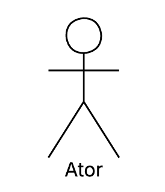

# Casos de Uso

## Descrição
Os casos de uso descrevem como o usuário interage com o sistema para realizar determinadas tarefas ou atingir objetivos específicos. Eles representam os diferentes cenários de uso, mostrando as ações do usuário e as respostas do sistema em cada situação. Essa técnica ajuda a compreender melhor o comportamento esperado da aplicação e garante que todos os requisitos funcionais sejam identificados e documentados de forma clara.

## Objetivo
O objetivo dos casos de uso é detalhar o funcionamento do sistema a partir da perspectiva do usuário, facilitando o entendimento entre desenvolvedores, analistas e stakeholders. Com eles, é possível visualizar os principais fluxos de interação, identificar possíveis falhas ou melhorias e assegurar que o sistema atenda às necessidades reais dos usuários e aos requisitos definidos no projeto.

## Metodologia
| Nome         | Função                     | Elemento                          |
|--------------|----------------------------|-----------------------------------|
| Sistema      | Representado por um retangulo o sistema define os limites do sistema, indicando o que está dentro do seu escopo e o que está fora representando o conjunto de funcionalidades que serão modeladas    |   |
| Atores       | Representado por bonecos palito os atores representam os usuários, pessoas ou outros sistemas que interagem com o sistema principal, executando ações ou recebendo respostas      |     |
| Casos de Uso      | Repesentado por uma forma geometrica oval os casos de uso descrevem as funcionalidades ou serviços que o sistema oferece aos atores sendo que cada caso de uso representa um objetivo ou tarefa que o usuário pode realizar |  |
| Relacionamento de Associação | Representado por uma linha contínua o relacionamento de associação mostra a ligação direta entre um ator e um caso de uso, indicando que o ator participa daquela funcionalidade|  |
| Relacionamento de Inclusão| Representado por uma linha tracejada ligando um caso de uso base até um caso de uso incluído com uma seta no final. O relacionamento de inclusão indica que um caso de uso inclui obrigatoriamente outro caso de uso em seu fluxo normal de execução|  |
| Relacionamento de Extensão | Representado por uma linha tracejada ligando um caso de uso estendido até um caso de uso base com uma seta no final. O relacionamento de extensão representa comportamentos opcionais ou condicionais, que ocorrem apenas em determinadas situações dentro de um caso de uso |   |
| Relacionamento de Generalização | Representado por uma seta contínua ligando o caso de uso especializado ao caso de uso geral, com um triângulo na ponta voltado para o caso de uso geral. O relacionamento de generalização mostra a herança entre atores ou casos de uso, quando um elemento herda características ou comportamentos de outro |    |

Fonte : [Guilherme](https://github.com/GuilhermeOliveira1327), 2025

## Especificação do Caso de Uso

A especificação de casos de uso é uma técnica usada para descrever, de forma detalhada, as interações entre os usuários e o sistema. Seu objetivo é documentar o fluxo completo de eventos que ocorre em cada caso de uso.

A seguinte tabela contem a especificação de caso de uso para o requisito Permitir que o usuário defina um alerta de preço para a carta selecionada

**Tabela X -** Requisito Permitir que o usuário defina um alerta de preço para a carta selecionada.

| Campo                   | Descrição                                                                                                                                                                                                                                                                                                                                                                                                                                                                                |
|:------------------------|:-----------------------------------------------------------------------------------------------------------------------------------------------------------------------------------------------------------------------------------------------------------------------------------------------------------------------------------------------------------------------------------------------------------------------------------------------------------------------------------------|
| **ID**                  | UC01                                                                                                                                                                                                                                                                                                                                                                                                                                                                                     |
| **Nome do Caso de Uso** | **Reportar Erro em Carta ou Anúncio**                                                                                                                                                                                                                                                                                                                                                                                                                                                    |
| **Ator Pricipal**       | - Usuário  (comprador) - Administrador                                                                                                                                                                                                                                                                                                                                                                                                                                                |
| **Descrição**           | Permite que o usuário, ao identificar um erro nas informações de uma carta ou em um anúncio de algum vendedor, possa enviar um reporte identificando o erro encontrado para a administração da plataforma para análise e correção.                                                                                                                                                                                                                                                       |
| **Pré-condição**        | - Usuário está navegando em uma página de uma carta específica  e está logado em sua conta.                                                                                                                                                                                                                                                                                                                                                                                              |
| **Pós-condição**        | - Um novo reporte de erro é criado no sistema.  - O reporte é associado à carta específica onde o erro foi encontrado.  - O usuário recebe uma confirmação visual do envio do seu reporte.                                                                                                                                                                                                                                                                                         |
| **Fluxo principal**     | 1. Usuário clica no botão “Reportar Problema” na página da carta. 2. Sistema exibe um formulário de reporte . 3. Usuário seleciona o tipo de erro (Dados da Carta Incorretos, Formato da carta incorreto, Preço incorreto). 4. Usuário escreve uma descrição detalhada do problema. 5. Usuário marca a caixa "Não sou um robô" e submete o formulário. 6. Sistema valida os dados e registra o reporte . 7. Sistema exibe a mensagem "Problema reportado com sucesso." |
| **Fluxo Alternativo**   | **A1 – Usuário quer reportar um bug geral:** Passo 1: Usuário clica no link "Contato" ou "Ajuda" no rodapé do site.  Utiliza o formulário de contato geral para descrever o bug de funcionalidade, em vez do formulário específico da página.                                                                                                                                                                                                                                      |
| **Fluxo de Exceções**   | **E1 – Falha de conexão:**  No Passo 5, se a conexão com a internet falhar, o sistema exibe a mensagem "Falha no envio. Verifique sua conexão e tente novamente.".                                                                                                                                                                                                                                                                                                                 |

Fonte: [Vera Lucia](https://github.com/verabelucia), 2025

### Requsito - Definir aleta de preço para uma carta

A seguinte tabela contem a especificação de caso de uso para o requisito Permitir que o usuário defina um alerta de preço para a carta selecionada

**Tabela X** - Requisito: Definir aleta de preço para uma carta.

| Campo                     | Descrição                                                                                                                                                                                                                                                                                                                                                                                                                                                                                                                                                                                                   |
|:--------------------------|:------------------------------------------------------------------------------------------------------------------------------------------------------------------------------------------------------------------------------------------------------------------------------------------------------------------------------------------------------------------------------------------------------------------------------------------------------------------------------------------------------------------------------------------------------------------------------------------------------------|
| **ID**                    | UC02                                                                                                                                                                                                                                                                                                                                                                                                                                                                                                                                                                                                        |
| **Nome do Caso de Uso**   | Definir Alerta de Preço para uma Carta                                                                                                                                                                                                                                                                                                                                                                                                                                                                                                                                                                      |
| **Ator Principal**        | Usuário Autenticado                                                                                                                                                                                                                                                                                                                                                                                                                                                                                                                                                                                         |
| **Descrição**             | Permite que um usuário autenticado crie uma notificação automática para ser avisado quando o preço de uma carta específica atingir um valor desejado.                                                                                                                                                                                                                                                                                                                                                                                                                                                       |
| **Pré-condições**         | - O usuário está autenticado (logado) no sistema. - O usuário está na página de detalhes da carta para a qual deseja criar o alerta.                                                                                                                                                                                                                                                                                                                                                                                                                                                                     |
| **Pós-condições**         | - Um novo registro de alerta de preço é criado no sistema, associado ao usuário e à carta. - O sistema exibe uma mensagem de sucesso para o usuário.                                                                                                                                                                                                                                                                                                                                                                                                                                                     |
| **Fluxo Principal**       | 1. O caso de uso inicia quando o usuário clica no botão "Criar Alerta de Preço". 2. O sistema exibe um formulário (modal) contendo os campos: Condição (ex: "Preço abaixo de", "Preço acima de") e Valor (R$). 3. O usuário seleciona a condição "Preço abaixo de". 4. O usuário insere um valor de preço válido no campo "Valor". 5. O usuário clica no botão "Salvar Alerta". 6. O sistema valida os dados inseridos. 7. O sistema cria o registro do alerta de preço no banco de dados. 8. O sistema exibe a mensagem "Alerta de preço definido com sucesso!" e fecha o formulário. |
| **Fluxo Alternativo**  | **A1. Desistência da Criação do Alerta:** - No passo 2 do Fluxo Principal, o usuário clica no botão "Cancelar" ou no ícone para fechar o formulário. - O sistema fecha o formulário sem salvar nenhuma informação. O caso de uso termina.                                                                                                                                                                                                                                                                                                                                                             |
| **Fluxo de Exceção**   | **E1. Valor Inválido ou Ausente:** - No passo 5 do Fluxo Principal, o usuário clica em "Salvar Alerta" sem preencher o campo "Valor" ou com um valor não numérico/negativo. - O sistema exibe a mensagem de erro "Por favor, insira um valor de preço válido." - O formulário permanece aberto para que o usuário corrija a informação.                                                                                                                                                                                                                                                         |

Fonte: [Vera Lucia](https://github.com/verabelucia), 2025

## Bibliografia
> 1. LUCID SOFTWARE PORTUGUÊS. Tutorial de Caso de Uso UML. YouTube, 20 mar. 2020. Disponível em: [Vídeo Completo](https://www.youtube.com/watch?v=ab6eDdwS3rA). Acesso em: 07 out. 2025. 

## Nível de Contribuição dos Integrantes

| Nome | % de Contribuição |
| :--- | :---------------: |
|   [Guilherme](https://github.com/GuilhermeOliveira1327)    |                   |
|   [Angélica](https://github.com/angelicaccampos)    |                   |

## Histórico de versão

| Versão | Data | Descrição | Autor(es) | Revisor |
| :----: | :--: | :-------- | :-------: | :-----: |
|   1.0     |  07/10/2025    |    Adição da Descrição, objetivo e metodologia    |   [Guilherme](https://github.com/GuilhermeOliveira1327)        |   [Angélica](https://github.com/angelicaccampos)      |
