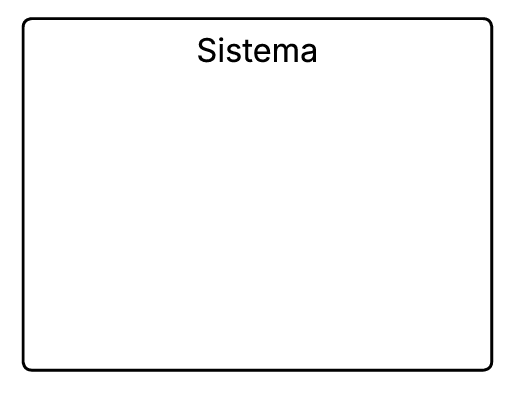
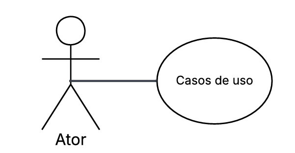

# Casos de Uso

## Descrição
Os casos de uso descrevem como o usuário interage com o sistema para realizar determinadas tarefas ou atingir objetivos específicos. Eles representam os diferentes cenários de uso, mostrando as ações do usuário e as respostas do sistema em cada situação. Essa técnica ajuda a compreender melhor o comportamento esperado da aplicação e garante que todos os requisitos funcionais sejam identificados e documentados de forma clara.

## Objetivo
O objetivo dos casos de uso é detalhar o funcionamento do sistema a partir da perspectiva do usuário, facilitando o entendimento entre desenvolvedores, analistas e stakeholders. Com eles, é possível visualizar os principais fluxos de interação, identificar possíveis falhas ou melhorias e assegurar que o sistema atenda às necessidades reais dos usuários e aos requisitos definidos no projeto.

## Metodologia
| Nome         | Função                     | Elemento                          |
|--------------|----------------------------|-----------------------------------|
| Sistema      | Representado por um retangulo o sistema define os limites do sistema, indicando o que está dentro do seu escopo e o que está fora representando o conjunto de funcionalidades que serão modeladas    |   |
| Atores       | Representado por bonecos palito os atores representam os usuários, pessoas ou outros sistemas que interagem com o sistema principal, executando ações ou recebendo respostas      |     |
| Casos de Uso      | Repesentado por uma forma geometrica oval os casos de uso descrevem as funcionalidades ou serviços que o sistema oferece aos atores sendo que cada caso de uso representa um objetivo ou tarefa que o usuário pode realizar |  |
| Relacionamento de Associação | Representado por uma linha contínua o relacionamento de associação mostra a ligação direta entre um ator e um caso de uso, indicando que o ator participa daquela funcionalidade|  |
| Relacionamento de Inclusão| Representado por uma linha tracejada ligando um caso de uso base até um caso de uso incluído com uma seta no final. O relacionamento de inclusão indica que um caso de uso inclui obrigatoriamente outro caso de uso em seu fluxo normal de execução|  |
| Relacionamento de Extensão | Representado por uma linha tracejada ligando um caso de uso estendido até um caso de uso base com uma seta no final. O relacionamento de extensão representa comportamentos opcionais ou condicionais, que ocorrem apenas em determinadas situações dentro de um caso de uso |   |
| Relacionamento de Generalização | Representado por uma seta contínua ligando o caso de uso especializado ao caso de uso geral, com um triângulo na ponta voltado para o caso de uso geral. O relacionamento de generalização mostra a herança entre atores ou casos de uso, quando um elemento herda características ou comportamentos de outro |    |

Fonte : [Guilherme](https://github.com/GuilhermeOliveira1327), 2025

## Bibliografia
> 1. LUCID SOFTWARE PORTUGUÊS. Tutorial de Caso de Uso UML. YouTube, 20 mar. 2020. Disponível em: [Vídeo Completo](https://www.youtube.com/watch?v=ab6eDdwS3rA). Acesso em: 07 out. 2025. 

## Nível de Contribuição dos Integrantes

| Nome | % de Contribuição |
| :--- | :---------------: |
|   [Guilherme](https://github.com/GuilhermeOliveira1327)    |                   |
|   [Angélica](https://github.com/angelicaccampos)    |                   |

## Histórico de versão

| Versão | Data | Descrição | Autor(es) | Revisor |
| :----: | :--: | :-------- | :-------: | :-----: |
|   1.0     |  07/10/2025    |    Adição da Descrição, objetivo e metodologia    |   [Guilherme](https://github.com/GuilhermeOliveira1327)        |   [Angélica](https://github.com/angelicaccampos)      |
