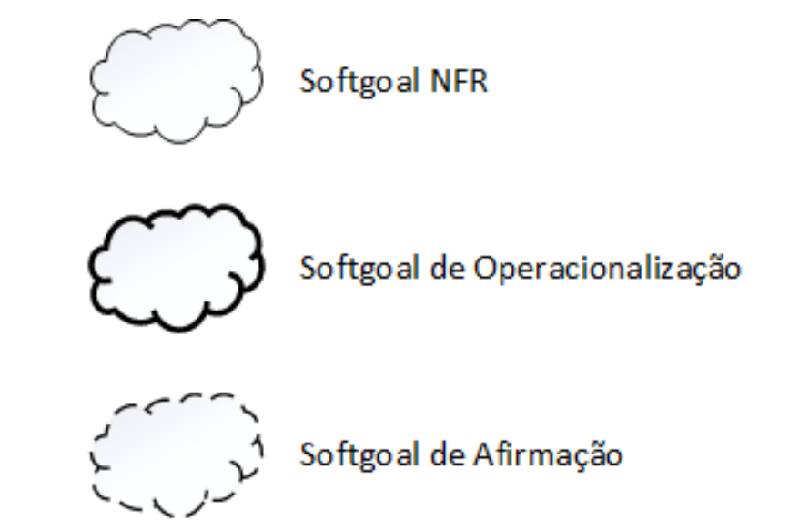
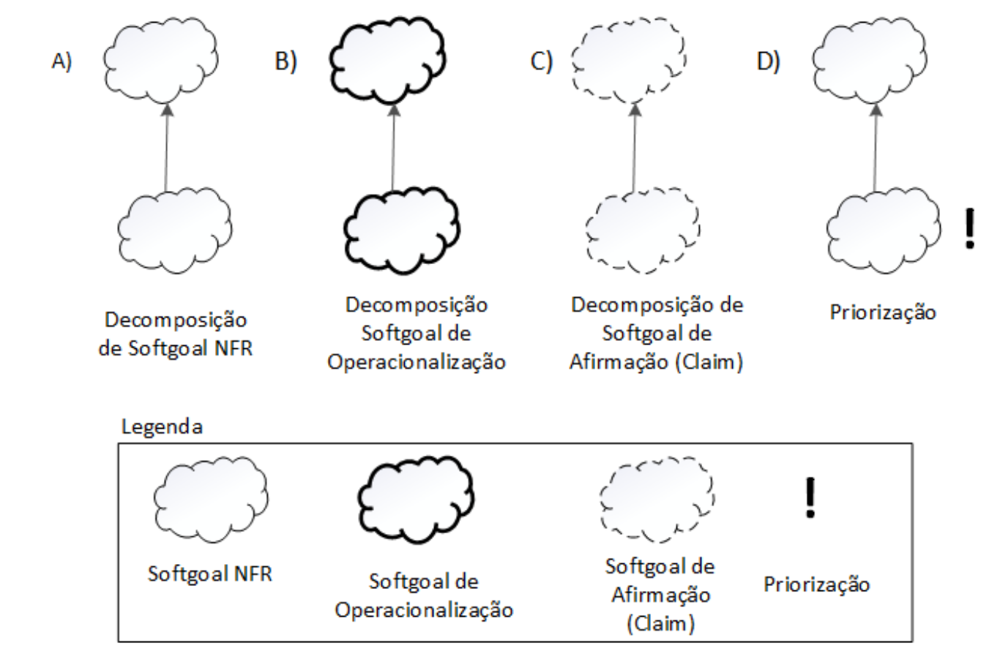
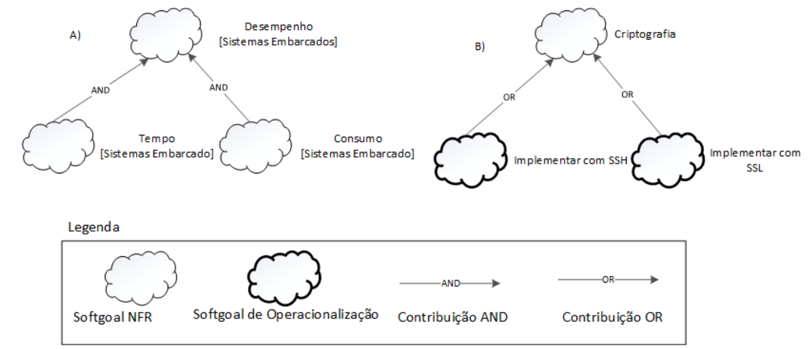
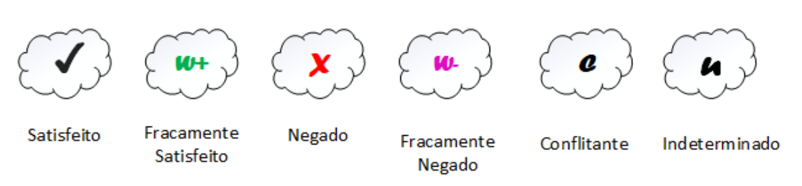

# NFR

## Descrição

O NFR Framework é uma abordagem proposta por Chung et al.[¹]() para representar e analisar requisitos não funcionais em sistemas de software. Ele é importante porque esses requisitos — como desempenho, segurança e usabilidade — influenciam diretamente na qualidade do sistema, mas muitas vezes não são claramente definidos durante o desenvolvimento. Para aplicar o framework, é necessário compreender os softgoals, que representam objetivos de qualidade, e o grafo de interdependência (SIG), usado para mostrar como os requisitos se relacionam e se afetam. Dessa forma, o NFR Framework ajuda a visualizar e equilibrar as decisões de projeto, contribuindo para sistemas mais consistentes e de melhor qualidade.

### SIG - Softgoal Interdependency Graph

No NFR Framework, o funcionamento do modelo é representado por meio do Softgoal Interdependency Graph (SIG), um gráfico que ilustra a relação e a interdependência entre os softgoals (requisitos não funcionais). O SIG atua como um registro visual das decisões tomadas durante o processo de desenvolvimento, mostrando como cada requisito, alternativa e justificativa se conectam dentro do sistema. Esse gráfico permite uma análise incremental e iterativa das decisões, facilitando a revisão e a rastreabilidade dos impactos entre os softgoals. Além disso, o SIG possibilita a execução de procedimentos de avaliação para verificar se os requisitos de nível superior foram satisfeitos, contribuindo para uma visão clara e estruturada da lógica e das prioridades do projeto[¹]().

### Tipos de Softgoals

No NFR Framework, existem três tipos principais de softgoals:

- **Softgoals NFR**: representam os requisitos não funcionais, organizados de forma hierárquica e inter-relacionada.
- **Softgoals de Operacionalização**: correspondem às soluções práticas para satisfazer os softgoals NFR, incluindo processos, dados e restrições do sistema.
- **Softgoals de Afirmação**: refletem características do domínio e justificam decisões de priorização e refinamento dos softgoals, fortalecendo a rastreabilidade do projeto[¹]().

A forma como os softgoals são representados pode ser observada na Figura 1, que ilustra graficamente sua estrutura.

<strong>Figura 1 – Representação dos Softgoals no NFR Framework.</strong>

<em>Fonte: CHUNG et al., 2000.</em>

### Interdependências

As interdependências definem as relações entre os softgoals. No NFR Framework, essas relações são representadas por dois tipos principais de interdependência: os refinamentos e as contribuições.
Essas interdependências permitem visualizar como os softgoals se influenciam mutuamente dentro do sistema, revelando dependências hierárquicas e impactos entre diferentes requisitos de qualidade.

#### Decomposições (Refinamentos)

Os refinamentos representam o tipo de interdependência que ocorre de forma hierárquica (top-down), quando um softgoal ascendente (pai) gera um ou mais softgoals descendentes (filhos), que se relacionam com o objetivo principal.
Os refinamentos podem ocorrer por meio de decomposição, operacionalização e afirmação, permitindo detalhar gradualmente os requisitos não funcionais até níveis mais específicos e aplicáveis ao projeto (CHUNG et al., 2000).

Os quatro tipos de decomposição utilizados pelo NFR Framework são:

- **Decomposição de Softgoal NFR**: subdivide um softgoal NFR em outros mais específicos, ajudando a dividir grandes problemas em partes menores e mais manejáveis.
- **Decomposição de Operacionalização**: subdivide um softgoal de operacionalização em outros mais específicos, definindo soluções práticas e refinadas.
- **Decomposição de Afirmação (Claims)**: refina softgoals de afirmação, úteis para apoiar ou negar justificativas de projeto.
- **Priorização**: tipo especial de decomposição que refina um softgoal com o mesmo tipo, mas associado a diferentes níveis de prioridade.

Essas decomposições permitem representar, dentro do grafo SIG, a estrutura de refinamento dos requisitos não funcionais, auxiliando na rastreabilidade e na clareza das decisões de projeto.

<strong>Figura 2 – Tipos de decomposição</strong>

<em>Fonte: CHUNG et al., 2000.</em>

### Contribuições

Durante o refinamento dos softgoals, cada elemento descendente pode contribuir total ou parcialmente, e de forma positiva ou negativa, para a satisfação do softgoal ascendente (CHUNG et al., 2000).
Essas contribuições permitem analisar o equilíbrio entre diferentes requisitos não funcionais — por exemplo, como melhorar o desempenho pode prejudicar a segurança, ou como aumentar a usabilidade pode impactar na eficiência.

Os principais tipos de contribuições do NFR Framework incluem:

- **AND**: todos os softgoals descendentes devem ser satisfeitos para que o ascendente também seja.
- **OR**: a satisfação de qualquer softgoal descendente é suficiente para satisfazer o ascendente.

<strong>Figura 3 – Exemplos de contribuições "AND" e "OR"</strong>

<em>Fonte: Silva, Reinaldo Antônio da NFR4ES: um Catálogo de Requisitos Não-Funcionais para Sistemas Embarcados/ Reinaldo Antônio da Silva – 2019.</em>

- **MAKE** (++): contribuição fortemente positiva.
- **BREAK** (--): contribuição fortemente negativa.
- **HELP** (+): contribuição parcialmente positiva.
- **HURT** (-): contribuição parcialmente negativa.

<strong>Figura 4 – Exemplos de contribuições ” MAKE", ”BREAK ", ”HELP" e ”HURT"</strong>

<em>Fonte: Silva, Reinaldo Antônio da 
NFR4ES: um Catálogo de Requisitos Não-Funcionais para
Sistemas Embarcados/ Reinaldo Antônio da Silva – 2019.</em>

- **UNKNOWN** (?): contribuição desconhecida (pode ser positiva ou negativa).
- **EQUALS**: o softgoal descendente só será satisfeito se o ascendente também for.
- **SOME** (+/-): contribuição com sinal conhecido (positivo ou negativo), mas intensidade incerta.

Essas relações permitem que o analista compreenda como os softgoals se reforçam ou se contradizem dentro do sistema, servindo como base para o processo de propagação de impactos.

<strong>Figura 5 – Exemplos de contribuições"SOME", UNKNOWN e EQUALS</strong>

<em>Fonte: Silva, Reinaldo Antônio da 
NFR4ES: um Catálogo de Requisitos Não-Funcionais para
Sistemas Embarcados/ Reinaldo Antônio da Silva – 2019.</em>

### Propagação de Impactos (Procedimento de Avaliação)

O procedimento de avaliação tem como objetivo determinar o grau de satisfação dos requisitos não funcionais a partir de um conjunto de decisões do projeto.
Durante esse processo, cada softgoal do SIG é rotulado de acordo com o nível de satisfação alcançado, permitindo avaliar se os objetivos de qualidade foram atingidos.

Os principais rótulos utilizados são:

- **Satisfeito**
- **Fracamente satisfeito**
- **Negado**
- **Fracamente negado**
- **Conflitante**
- **Indeterminado**

<strong>Figura 6 – Tipos de rótulos utilizados pelos softgoals</strong>

<em>Fonte: CHUNG et al., 2000.</em>

Esses rótulos são aplicados de forma iterativa, começando pelos softgoals de nível mais baixo na hierarquia e propagando os resultados até os softgoals de nível superior.
Esse procedimento permite compreender o impacto cumulativo das decisões sobre a qualidade do sistema, facilitando ajustes e priorizações ao longo do desenvolvimento.

### Cartões de Especificação

Os cartões de especificação servem para registrar de forma detalhada cada requisito não funcional (softgoal) que identificamos. Eles oferecem um formato padronizado, o que torna mais fácil entender, analisar e acompanhar esses requisitos ao longo do projeto.

Abaixo está o modelo padrão para os cartões de especificação:

| Item                      | Descrição                                                                             |
| ------------------------- | ------------------------------------------------------------------------------------- |
| **ID**                    | **[NFRx]** - Identificador único sequencial.                                          |
| **Requisito**             | **[RNFx]** - Identificador único sequencial.                                          |
| **Classificação**         | **[Categoria > Subcategoria]** - Classificação hierárquica do RNF (ex: SUP > COMP).   |
| **Descrição**             | Declaração clara, objetiva e única do requisito.                                      |
| **Justificativa**         | A razão de negócio ou técnica para a existência do requisito.                         |
| **Origem**                | A fonte do requisito (Técnicas de Elicitação).                                        |
| **Critério de Aceitação** | Uma métrica objetiva e testável que define quando o requisito é considerado atendido. |
| **Dependências**          | Relações com outros RNFs, indicando sinergias ou pré-requisitos.                      |
| **Prioridade**            | Nível de importância do requisito em uma escala de 1 (menor) a 10 (maior).            |
| **Conflitos**             | Lista de outros requisitos que podem ser negativamente impactados por este.           |
| **História**              | Registro de data de criação e alterações relevantes no requisito.                     |

<strong>Tabela 1:</strong> Modelo padrão dos cartões

**Fonte:** Samuel, 2025

## Objetivo

O objetivo desse trabalho é representar, analisar e documentar os Requisitos Não-Funcionais (RNFs) do site LigaMagic, utilizando o NFR Framework para garantir a qualidade do sistema. Eles são divididos como:

- **1.Classificar**: Os Requisitos Não Funcionais em Requisitos de Produto, Requisitos de Processo e Requisitos Externos, conforme a classificação proposta por Kotonya e Sommerville (1998). Este trabalho tem como foco principal os Requisitos de Produto, abrangendo aspectos como Usabilidade, Performance, Portabilidade e Disponibilidade, além de identificar os Requisitos Externos quando aplicável.
- **2.Detalhar**: Requisitos específicos, fornecendo uma declaração clara e justificativa e, principalmente, um critério de Aceitação (que seja objetiva e testável) para definir quando o requisito é considerado atendido.
- **3.Identificar as relações de interdependência e conflitos**: Um exemplo é com a manutenibilidade e custo entre os RNFs no projeto.

## Metodologia

A metodologia adotada para o tratamento e especificação dos Requisitos Não-Funcionais baseia-se na aplicação do NFR Framework.

Os principais procedimentos metodológicos utilizados e documentados na estrutura incluem:

**1. Utilização de Softgoals**: Representar os requisitos não funcionais (RNFs) como Softgoals NFR, que são objetivos de qualidade que influenciam o sistema.

**2. Modelagem de Relações**: Uso do Softgoal Interdependency Graph (SIG) (Gráfico de Interdependência de Softgoals) para registrar visualmente as decisões de desenvolvimento e ilustrar a relação e interdependência entre os softgoals. O SIG permite visualizar como os softgoals se influenciam mutuamente, revelando dependências hierárquicas e impactos. As relações (interdependências) são classificadas em:

- Refinamentos/Decomposições: Ocorre de forma hierárquica (top-down), detalhando softgoals mais amplos em objetivos mais específicos, como a Decomposição de Softgoal NFR ou Priorização.
- Contribuições: Descrevem como um softgoal descendente impacta a satisfação do softgoal ascendente (positiva ou negativamente). Os tipos de contribuição incluem: MAKE (++), BREAK (--), HELP (+), HURT (-) e UNKNOWN (?).

**3. Especificação Detalhada (Cartões de Especificação)**: Uso de um formato padronizado para registrar cada requisito não funcional, facilitando a análise e o acompanhamento. Este modelo padrão (baseado no snowcard) inclui campos essenciais como ID, Requisito, Classificação, Descrição, Justificativa, Critério de Aceitação, Prioridade, Dependências e Conflitos.

**4. Classificação de RNFs**: De acordo com a classificação proposta por Kotonya e Sommerville (1998), os Requisitos Não Funcionais podem ser agrupados em três categorias: **Requisitos de Produto**, **Requisitos de Processo** e **Requisitos Externos**.

**Requisitos de Produto:**

- **Usabilidade:** Inclui requisitos como responsividade do site (RNF08), clareza na apresentação das informações (RNF09) e padronização de mensagens (RNF14).
- **Performance:** Inclui tempo de resposta (RNF10) e capacidade de suportar aumento de usuários simultâneos (RNF16).
- **Portabilidade:** Inclui compatibilidade com os principais navegadores (RNF12) e flexibilidade para alterações sem interrupção (RNF06).
- **Disponibilidade:** Inclui tempo de atividade do sistema (RNF11) e backup automático dos dados (RNF15).

**Requisitos Externos:**

- **Legal e Regulatório:** inclui requisitos por dependerem de fatores legais e regulatórios, como RNF01 (cumprimento de legislações aplicáveis) e RNF07 (informações fiscais corretas).

### Tabela de contribuição

|       NFR       | Nome                                          |   Autor   |                                                   Requisito Associado                                                   |
| :-------------: | :-------------------------------------------- | :-------: | :---------------------------------------------------------------------------------------------------------------------: |
| [NFR01](#nfr01) | Responsividade da plataforma                  |  Samuel   |                          [RNF12](../../03_elicitacao/artefatos/requisitos_elicitados.md#rnf12)                          |
| [NFR02](#nfr02) | Informações Legais e Tributárias              |  Marcelo  | [RNF07](https://requisitos-de-software.github.io/2025.2-LigaMagic/03_elicitacao/artefatos/requisitos_elicitados/#rnf07) |
| [NFR03](#nfr03) | Padronização de mensagens                     |  Raissa   |                          [RNF14](../../03_elicitacao/artefatos/requisitos_elicitados.md#rnf12)                          |
| [NFR04](#nfr04) | Cumprir legislações aplicáveis                | Guilherme |                          [RNF01](../../03_elicitacao/artefatos/requisitos_elicitados.md#rnf01)                          |
| [NRF05](#nfr05) | Organização visual                            |   Vera    |                          [RNF09](../../03_elicitacao/artefatos/requisitos_elicitados.md#rnf09)                          |
| [NRF06](#nfr06) | Exigir consentimento e concordância explícita | Angélica  |                          [RNF05](../../03_elicitacao/artefatos/requisitos_elicitados.md#rnf05)                          |
| [NRF07](#nfr07) | Adaptabilidade a Dispositivos Móveis          |  Thiago   |                          [RNF08](../../03_elicitacao/artefatos/requisitos_elicitados.md#rnf08)                          |

<strong>Tabela 2:</strong> Tabela de contribuição

### Classificação dos RNFs

#### **Requisitos de Produto**

##### **Usabilidade**

- **RNF08** – O site deve ser totalmente responsivo, garantindo boa visualização e funcionalidade em computador, tablet e smartphone.
- **RNF09** – As informações sobre cartas, anúncios e decks devem ser organizadas de forma clara e legível.
- **RNF14** – As mensagens de alerta, erro e confirmação devem aparecer de forma padronizada e visível.
- **RNF04** – O sistema deve informar os usuários sobre mudanças relevantes na política com antecedência razoável (transparência contribui para melhor experiência do usuário).

##### **Performance**

- **RNF10** – O sistema deve retornar resultados de busca em no máximo 3 segundos.
- **RNF16** – O sistema deve suportar um aumento de 50% no número de usuários simultâneos sem degradação significativa de performance.

##### **Portabilidade**

- **RNF08** – O site deve ser totalmente responsivo (também relacionado à usabilidade, mas afeta portabilidade).
- **RNF12** – A plataforma deve ser compatível com as versões mais recentes dos principais navegadores (Google Chrome, Firefox, Edge e Safari).
- **RNF06** – O sistema deve suportar alterações na configuração ou apresentação sem interromper o uso (flexibilidade e adaptação).

##### **Disponibilidade**

- **RNF11** – O sistema deve estar disponível 99,5% do tempo.
- **RNF15** – O sistema deve realizar backup automático dos dados a cada 24 horas (garante continuidade e recuperação).
- **RNF06** – O sistema deve suportar alterações sem interrupção de uso (também relacionado à manutenibilidade).

#### **Requisitos Externos**

##### **Legal e Regulatório**

- **RNF07** – Garantir que anúncios incluam informações fiscais corretas (precisão contribui para confiabilidade no desempenho).
- **RNF01** – O sistema deve cumprir legislações aplicáveis, assegurando conformidade e funcionamento correto (correção é base para desempenho confiável).
- **RNF05** – O sistema deve exigir que o usuário declare ciência e concordância explícita com os termos de uso e política de privacidade, conforme a Lei Geral de Proteção de Dados (LGPD – Lei nº 13.709/2018).

### NFRs

#### NFR01 - Responsividade da plataforma {#nfr01}

| Item                      | Descrição                                                                                                                                                                                                                                                                                                                                                                                                                                                                                                                                                                                                                                                                                                                                                                                                                                                                                                                        |
| ------------------------- | -------------------------------------------------------------------------------------------------------------------------------------------------------------------------------------------------------------------------------------------------------------------------------------------------------------------------------------------------------------------------------------------------------------------------------------------------------------------------------------------------------------------------------------------------------------------------------------------------------------------------------------------------------------------------------------------------------------------------------------------------------------------------------------------------------------------------------------------------------------------------------------------------------------------------------- |
| **ID**                    | NFR01                                                                                                                                                                                                                                                                                                                                                                                                                                                                                                                                                                                                                                                                                                                                                                                                                                                                                                                            |
| **Requisito**             | [RNF12](../../03_elicitacao/artefatos/requisitos_elicitados.md#rnf12)                                                                                                                                                                                                                                                                                                                                                                                                                                                                                                                                                                                                                                                                                                                                                                                                                                                            |
| **Classificação**         | Suportabilidade > Compatibilidade                                                                                                                                                                                                                                                                                                                                                                                                                                                                                                                                                                                                                                                                                                                                                                                                                                                                                                |
| **Descrição**             | A plataforma deve ser totalmente compatível com as versões mais recentes dos principais navegadores do mercado (Google Chrome, Mozilla Firefox, Microsoft Edge e Safari), tanto em suas versões para desktop quanto para dispositivos móveis (Android e iOS).                                                                                                                                                                                                                                                                                                                                                                                                                                                                                                                                                                                                                                                                    |
| **Justificativa**         | Garantir que a vasta e diversificada base de usuários de _Magic: The Gathering_ possa acessar a plataforma sem barreiras técnicas, independentemente do dispositivo ou navegador de sua preferência. A compatibilidade ampla maximiza o alcance do produto, aumenta a satisfação e reduz a taxa de abandono por frustração técnica.                                                                                                                                                                                                                                                                                                                                                                                                                                                                                                                                                                                              |
| **Origem**                | [Observação](../../03_elicitacao/tecnicas/observacao.md)                                                                                                                                                                                                                                                                                                                                                                                                                                                                                                                                                                                                                                                                                                                                                                                                                                                                         |
| **Critério de Aceitação** | **Compatibilidade do aplicativo mobile:**  - O aplicativo deve ser instalável e totalmente funcional nas duas últimas versões estáveis dos sistemas operacionais Android e iOS.  - A interface deve seguir as diretrizes de design de cada plataforma para garantir uma experiência nativa e intuitiva.  - O layout deve ser fluido e adaptar-se a diferentes tamanhos e densidades de tela de smartphones, sem perda de funcionalidade.  - Todas as funcionalidades (fóruns, busca, etc.) devem operar sem erros e com performance otimizada para o ambiente mobile.   **Compatibilidade Desktop:**  - A versão web da plataforma deve operar sem erros nas últimas versões estáveis dos navegadores Google Chrome, Mozilla Firefox, Microsoft Edge e Safari.  - A interface deve ser renderizada corretamente, sem quebras de layout ou sobreposição de elementos, em todos os navegadores suportados. |
| **Dependências**          | Nenhum                                                                                                                                                                                                                                                                                                                                                                                                                                                                                                                                                                                                                                                                                                                                                                                                                                                                                                                           |
| **Prioridade**            | **9**                                                                                                                                                                                                                                                                                                                                                                                                                                                                                                                                                                                                                                                                                                                                                                                                                                                                                                                            |
| **Conflitos**             | - **Manutenibilidade (𝒲-)**: A gestão de bases de código distintas (Android, iOS, Web) aumenta a complexidade da manutenção. Corrigir um bug pode exigir implementações separadas para cada plataforma, e a introdução de novas funcionalidades torna-se um processo mais lento e propenso a inconsistências.  - **Tempo de Lançamento no Mercado (𝒲-)**: A necessidade de desenvolver, testar e aprovar o aplicativo em duas lojas de aplicativos distintas (Google Play Store e Apple App Store) pode atrasar o lançamento de novas funcionalidades em comparação com uma simples atualização no lado do servidor de uma aplicação web.  - **Complexidade Técnica (𝒲-)**: Aumenta a complexidade geral do projeto, exigindo conhecimento sobre SDKs nativos, processos de compilação específicos, diretrizes de publicação de cada loja e gestão de diferentes ciclos de vida da aplicação.                              |
| **História**              | Criado em 18/10/2025                                                                                                                                                                                                                                                                                                                                                                                                                                                                                                                                                                                                                                                                                                                                                                                                                                                                                                             |

<strong>Tabela 3:</strong> Responsividade da plataforma

**Fonte:** Samuel, 2025

#### NFR02 - Informações Legais e Tributárias {#nfr02}

| **Item**                  | **Descrição**                                                                                                                                                                                                                                                                                                                                                                                                                                                                                                                                                                                                                                                                                                                                                                                                                         |
| ------------------------- | ------------------------------------------------------------------------------------------------------------------------------------------------------------------------------------------------------------------------------------------------------------------------------------------------------------------------------------------------------------------------------------------------------------------------------------------------------------------------------------------------------------------------------------------------------------------------------------------------------------------------------------------------------------------------------------------------------------------------------------------------------------------------------------------------------------------------------------- |
| **ID**                    | NRF02                                                                                                                                                                                                                                                                                                                                                                                                                                                                                                                                                                                                                                                                                                                                                                                                                                 |
| **Requisito**             | [RNF07](https://requisitos-de-software.github.io/2025.2-LigaMagic/03_elicitacao/artefatos/requisitos_elicitados/#rnf07)                                                                                                                                                                                                                                                                                                                                                                                                                                                                                                                                                                                                                                                                                                               |
| **Classificação**         | Performance > Confiabilidade de Dados Fiscais                                                                                                                                                                                                                                                                                                                                                                                                                                                                                                                                                                                                                                                                                                                                                                                         |
| **Descrição**             | A plataforma deve garantir que todos os anúncios incluam informações fiscais e tributárias corretas e obrigatórias, de acordo com a legislação brasileira, assegurando a exatidão e integridade desses dados durante todo o processo de venda.                                                                                                                                                                                                                                                                                                                                                                                                                                                                                                                                                                                        |
| **Justificativa**         | A exibição de informações fiscais corretas é essencial para garantir transparência, confiança entre usuários e conformidade com normas legais. Evita fraudes, melhora a reputação da plataforma e assegura o cumprimento de obrigações fiscais.                                                                                                                                                                                                                                                                                                                                                                                                                                                                                                                                                                                       |
| **Origem**                | [Análise de Documentos](../tecnicas/analise_legislacao.md)                                                                                                                                                                                                                                                                                                                                                                                                                                                                                                                                                                                                                                                                                                                                                                            |
| **Critério de Aceitação** | **Validação de Dados Fiscais:**  - O sistema deve exigir que todo anunciante informe um CNPJ ou CPF válido ao cadastrar um anúncio.  - O sistema deve validar o formato e autenticidade do CNPJ/CPF informado, impedindo o cadastro de anúncios inválidos.  - Cada anúncio deve apresentar o CNPJ/CPF do vendedor e o valor total com impostos inclusos.  - O sistema deve permitir anexar ou gerar uma Nota Fiscal Eletrônica (NF-e) quando aplicável.  - Em transações entre pessoas físicas, deve ser exibido um aviso informando que a plataforma não é responsável por obrigações fiscais entre as partes.    **Conformidade Legal:**  - O sistema deve estar de acordo com a Lei nº 12.965/2014 (Marco Civil da Internet), o Decreto nº 7.962/2013 (Comércio Eletrônico) e a Lei nº 13.709/2018 (LGPD). |
| **Dependências**          | - **RF03 – Cadastro de Usuário:** necessário para associar CNPJ/CPF aos vendedores.  - **RF05 – Criar Anúncios:** utilizado para incluir e exibir informações fiscais no processo de anúncio.  - **RNF04 – Segurança e Privacidade:** dependência para garantir o armazenamento seguro e tratamento adequado dos dados fiscais.  - **Integração com API de validação fiscal (Receita Federal):** necessária para verificar autenticidade dos CNPJs/CPFs informados.                                                                                                                                                                                                                                                                                                                                                          |
| **Prioridade**            | **9**                                                                                                                                                                                                                                                                                                                                                                                                                                                                                                                                                                                                                                                                                                                                                                                                                                 |
| **Conflitos**             | - **Usabilidade (𝒲-)**: A obrigatoriedade de preencher dados fiscais pode tornar o processo de criação de anúncios mais demorado e menos intuitivo.  - **Desempenho (𝒲-)**: A validação externa de dados fiscais pode aumentar o tempo de resposta do sistema.  - **Privacidade (𝒲-)**: A exibição pública de dados fiscais pode conflitar com as restrições da LGPD e deve ser tratada com anonimização parcial.  - **Disponibilidade (𝒲-)**: Caso a API externa de validação fiscal esteja fora do ar, o cadastro de anúncios poderá ser temporariamente interrompido.                                                                                                                                                                                                                                                     |
| **História**              | Criado em 18/10/2025                                                                                                                                                                                                                                                                                                                                                                                                                                                                                                                                                                                                                                                                                                                                                                                                                  |

<strong>Tabela 4:</strong> Informações Legais e Tributárias

**Fonte:** Marcelo, 2025

#### NFR03 - Padronização de mensagens {#nfr03}

| Item                      | Descrição                                                                                                                                                                                                                                                                                                                                                                                                                           |
| ------------------------- | ----------------------------------------------------------------------------------------------------------------------------------------------------------------------------------------------------------------------------------------------------------------------------------------------------------------------------------------------------------------------------------------------------------------------------------- |
| **ID**                    | NFR03                                                                                                                                                                                                                                                                                                                                                                                                                               |
| **Requisito**             | [RNF14](https://requisitos-de-software.github.io/2025.2-LigaMagic/03_elicitacao/artefatos/requisitos_elicitados/#rnf14)                                                                                                                                                                                                                                                                                                             |
| **Classificação**         | Usabilidade > Padronização de Mensagem                                                                                                                                                                                                                                                                                                                                                                                              |
| **Descrição**             | O sistea deve exibir mensagens de alerta, erro, confirmação e informação de forma padronizada, consistente e visível em toda a plataforma, utilizando componentes, cores e linguagem que seja clara e fácil de entender para evitar confusões e garantir que o jogador entenda imediatamente                                                                                                                                        |
| **Justificativa**         | A padronização das mensagens melhora a experiência do jogador através de feedback visual, reduz erros de interpretação, acelera a tomada de decisão, seguindo princípios estabelecidos de design de interface e usabilidade.                                                                                                                                                                                                        |
| **Origem**                | Observação                                                                                                                                                                                                                                                                                                                                                                                                                          |
| **Critério de Aceitação** | - Usar cores no sistema, por exemplo, vermelhor para mensagens de erros críticos, Laranja para alertas ou avisos importantes, verde para mensagens de sucesso e azul para orientações. Modais de confirmação criticas, mensagens inline para validações de formulário                                                                                                                                                               |
| **Dependências**          | - RF03 – Sistema de Login/Autenticação: para mensagens de sucesso/erro de login.   -RF23 – Processo de Compra: para confirmações de transação e alertas de estoque.  - RF05 – Validação de Dados: para mensagens de erro em formulários.   - RNF08 – Responsividade: garantia de exibição correta em todos os dispositivos.   - RNF09 – Organização Visual: alinhamento com padrões de layout estabelecidos             |
| **Prioridade**            | 8                                                                                                                                                                                                                                                                                                                                                                                                                                   |
| **Conflitos**             | - Customização Contextual (𝒲-): Padronização rigorosa pode limitar adaptações específicas para diferentes fluxos.   - Performance (𝒲-): Sistema centralizado de mensagens pode adicionar complexidade ao gerenciamento de estado.   - Acessibilidade (𝒲+): Padronização facilita implementação consistente de recursos de acessibilidade.   - Manutenção (𝒲+): Sistema unificado reduz duplicação e facilita atualizações. |
| **História**              | Criado em 19/10/2025                                                                                                                                                                                                                                                                                                                                                                                                                |

<strong>Tabela 5: Padronização de mensagens</strong> 

**Fonte:** Raissa, 2025

#### NFR04 - Cumprir legislações aplicáveis {#nfr04}

| Item                      | Descrição                                                                                                                                                                                                                                                                                                                                                                                                                                                                                                                                                                                                                                                           |
| ------------------------- | ------------------------------------------------------------------------------------------------------------------------------------------------------------------------------------------------------------------------------------------------------------------------------------------------------------------------------------------------------------------------------------------------------------------------------------------------------------------------------------------------------------------------------------------------------------------------------------------------------------------------------------------------------------------- |
| **ID**                    | NFR04                                                                                                                                                                                                                                                                                                                                                                                                                                                                                                                                                                                                                                                               |
| **Requisito**             | [RNF01](https://requisitos-de-software.github.io/2025.2-LigaMagic/03_elicitacao/artefatos/requisitos_elicitados/#rnf01)                                                                                                                                                                                                                                                                                                                                                                                                                                                                                                                                             |
| **Classificação**         | Legal e Regulatório > Conformidade com Legislações Vigentes                                                                                                                                                                                                                                                                                                                                                                                                                                                                                                                                                                                                         |
| **Descrição**             | O sistema deve estar em conformidade com a Lei Geral de Proteção de Dados Pessoais (LGPD – Lei nº 13.709/2018), o Código de Defesa do Consumidor e demais legislações aplicáveis a serviços digitais e comércio eletrônico. Isso inclui a coleta, armazenamento, tratamento e exclusão de dados pessoais de forma segura e transparente, além da disponibilização de informações claras sobre direitos e deveres do consumidor.                                                                                                                                                                                                                                     |
| **Justificativa**         | A conformidade legal é essencial para a credibilidade e continuidade operacional do site Liga Magic. O descumprimento das legislações pode resultar em multas, sanções legais e perda de confiança dos usuários. Além disso, cumprir a LGPD garante que os dados pessoais dos clientes sejam tratados com segurança, respeitando seus direitos à privacidade e ao controle sobre suas informações.                                                                                                                                                                                                                                                                  |
| **Origem**                | [Ánalise de Documentos](../../03_elicitacao/tecnicas/analise_documentos.md)                                                                                                                                                                                                                                                                                                                                                                                                                                                                                                                                                                                         |
| **Critério de Aceitação** | **LGPD:**  - A plataforma deve exibir política de privacidade e termos de uso em local de fácil acesso.  - O usuário deve poder gerenciar o consentimento sobre o uso de seus dados pessoais (opt-in e opt-out).  - O sistema deve permitir que o usuário solicite a exclusão ou atualização de seus dados.  **Código de Defesa do Consumidor:**  - O site deve conter informações claras sobre produtos, preços, prazos de entrega e política de devolução.  - Deve ser garantido o direito de arrependimento (cancelamento em até 7 dias, conforme o art. 49). - As condições de compra e reembolso devem estar acessíveis e atualizadas. |
| **Dependências**          |  - Implementação de política de privacidade e termos de uso. - Módulo de gerenciamento de consentimento de dados. - Banco de dados seguro com criptografia e controle de acesso. - Suporte jurídico especializado para revisão de conformidade.                                                                                                                                                                                                                                                                                                                                                                                                         |
| **Prioridade**            | **10**                                                                                                                                                                                                                                                                                                                                                                                                                                                                                                                                                                                                                                                              |
| **Conflitos**             |  - **Usabilidade (𝒲-):** A inclusão de etapas de consentimento e formulários pode tornar a navegação mais longa ou complexa para o usuário. - **Desempenho (𝒲-):** Processos adicionais de criptografia e validação de dados podem impactar o tempo de resposta do sistema. - **Custo (𝒲-):** A implementação e manutenção de conformidade legal exigem investimento contínuo em segurança, auditorias e atualizações jurídicas.                                                                                                                                                                                                                           |
| **História**              | Criado em 19/10/2025                                                                                                                                                                                                                                                                                                                                                                                                                                                                                                                                                                                                                                                |

<strong>Tabela 6: Cumprir legislações aplicáveis</strong> 

**Fonte:** Guilherme, 2025

#### NRF05 - Organização visual {#nrf05}

| Item                  | Descrição                                                                                                                                                                                                                                                                                                                                                                |
| --------------------- | ------------------------------------------------------------------------------------------------------------------------------------------------------------------------------------------------------------------------------------------------------------------------------------------------------------------------------------------------------------------------ |
| ID                    | RNF09                                                                                                                                                                                                                                                                                                                                                                    |
| Requisito             | [RNF09](https://requisitos-de-software.github.io/2025.2-LigaMagic/03_elicitacao/artefatos/requisitos_elicitados/#rnf09)                                                                                                                                                                                                                                                  |
| Classificação         | Usabilidade > Organização visual                                                                                                                                                                                                                                                                                                                                         |
| Descrição             | As informações sobre cartas, anúncios e decks devem ser organizadas de forma clara, com boa legibilidade e espaçamento adequado, facilitando a navegação.                                                                                                                                                                                                                |
| Justificativa         | Uma organização visual clara melhora a experiência do usuário, reduz erros de navegação e aumenta a eficiência na busca por informações, alinhando-se às boas práticas de usabilidade do site LigaMagic.                                                                                                                                                                 |
| Origem                | [Análise de Documentos](../../03_elicitacao/tecnicas/analise_documentos.md)                                                                                                                                                                                                                                                                                              |
| Critério de Aceitação | - Usuário consegue localizar cartas, anúncios e decks em no máximo 3 cliques ou interações. - Todas as informações devem estar legíveis   - O espaçamento entre elementos (cartas, decks, anúncios) deve permitir leitura clara e evitar sobreposição. - Alterações no layout não devem causar quebras de interface em dispositivos desktop, tablet ou mobile. |
| Dependências          |RNF08 – O site deve ser totalmente responsivo, garantindo boa visualização e funcionalidade em computador, tablet e smartphone   RNF12 – A plataforma deve ser compatível com as versões mais recentes dos principais navegadores (Google Chrome, Firefox, Edge e Safari).                                                                                                                |
| Prioridade            | 9                                                                                                                                                                                                                                                                                                                                                                        |
| Conflitos             | [RNF16](https://requisitos-de-software.github.io/2025.2-LigaMagic/03_elicitacao/artefatos/requisitos_elicitados/#rnf16)                                                                                                                                                                                                                                                  |
| História              | Criado em 19/10/2025                                                                                                                                                                                                                                                                                                                                                     |

<strong>Tabela 7: Organização visual </strong> 

**Fonte:** Vera, 2025

#### NRF06 - Exigir consentimento e concordância explícita {#nrf06}

| Item                  | Descrição                                                                                                                                                                                                                                                                                                                                                                                                         |
| --------------------- | ----------------------------------------------------------------------------------------------------------------------------------------------------------------------------------------------------------------------------------------------------------------------------------------------------------------------------------------------------------------------------------------------------------------- |
| ID                    | RNF05                                                                                                                                                                                                                                                                                                                                                                                                             |
| Requisito             | [RNF05](https://requisitos-de-software.github.io/2025.2-LigaMagic/03_elicitacao/artefatos/requisitos_elicitados/#rnf05)                                                                                                                                                                                                                                                                                           |
| Classificação         | Legal e Regulatório > Conformidade                                                                                                                                                                                                                                                                                                                                                                                |
| Descrição             | O sistema deve garantir que o usuário declare ciência e concordância explícita com os termos de uso e política de privacidade antes de utilizar as funcionalidades do portal.                                                                                                                                                                                                                                     |
| Justificativa         | Assegurar a conformidade com a Lei Geral de Proteção de Dados (LGPD – Lei nº 13.709/2018) e demais legislações aplicáveis, garantindo que o usuário forneça consentimento informado e livre. Isso aumenta a transparência e a confiança na plataforma, além de proteger legalmente a organização.                                                                                                                 |
| Origem                | [Análise de Documentos](../../03_elicitacao/tecnicas/analise_documentos.md)                                                                                                                                                                                                                                                                                                                                       |
| Critério de Aceitação | - O sistema deve exibir um termo de consentimento antes do primeiro uso de qualquer funcionalidade restrita.  - O usuário só pode prosseguir após marcar explicitamente a opção “Li e concordo”.   - O sistema deve armazenar a confirmação de consentimento (data, hora e IP).   - Caso a política seja atualizada, o sistema deve solicitar novo consentimento ao usuário antes de continuar o uso. |
| Dependências          | [RNF04](https://requisitos-de-software.github.io/2025.2-LigaMagic/03_elicitacao/artefatos/requisitos_elicitados/#rnf0)                                                                                                                                                                                                                                                                                            |
| Prioridade            | 10                                                                                                                                                                                                                                                                                                                                                                                                                |
| Conflitos             | - **Usabilidade (𝒲-):**: Exigir consentimento pode tornar a primeira interação mais demorada, impactando ligeiramente a experiência do usuário.                                                                                                                                                                                                                                                                   |
| História              | Criado em 19/10/2025                                                                                                                                                                                                                                                                                                                                                                                              |

<strong>Tabela 8: Exigir consentimento e concordância explícita </strong> 

**Fonte:** Angélica, 2025

#### NFR07 - Adaptabilidade a Dispositivos Móveis {#nfr08}

| Item                      | Descrição                                                                                                                                                                                                                                                                                                                                                                                                                                                                                                                                                                                                 |
| ------------------------- | --------------------------------------------------------------------------------------------------------------------------------------------------------------------------------------------------------------------------------------------------------------------------------------------------------------------------------------------------------------------------------------------------------------------------------------------------------------------------------------------------------------------------------------------------------------------------------------------------------- |
| **ID**                    | NFR07                                                                                                                                                                                                                                                                                                                                                                                                                                                                                                                                                                                                     |
| **Requisito**             | [RNF08](../../03_elicitacao/artefatos/requisitos_elicitados.md#rnf08)                                                                                                                                                                                                                                                                                                                                                                                                                                                                                                                                     |
| **Classificação**         | Portabilidade > Usabilidade                                                                                                                                                                                                                                                                                                                                                                                                                                                                                                                                                                               |
| **Descrição**             | A interface do sistema deve se adaptar fluidamente a diferentes tamanhos de tela (viewports) e orientações (retrato e paisagem) específicas do ecossistema móvel.                                                                                                                                                                                                                                                                                                                                                                                                                                         |
| **Justificativa**         | Atender à fragmentação do mercado de dispositivos móveis, garantindo que a aplicação seja funcional e esteticamente agradável tanto em smartphones compactos quanto em "phablets" (telas grandes), independentemente de como o usuário segura o dispositivo.                                                                                                                                                                                                                                                                                                                                              |
| **Origem**                | [Observação](../../03_elicitacao/tecnicas/observacao.md)                                                                                                                                                                                                                                                                                                                                                                                                                                                                                                                                                  |
| **Critério de Aceitação** | 1. O layout deve ser funcional e legível em viewports móveis pequenas (ex: 320px a 375px de largura). 2. O layout deve otimizar o espaço em viewports móveis grandes (ex: 414px a 480px de largura), sem deixar espaços vazios ou elementos desproporcionais. 3. A transição entre as orientações retrato (vertical) e paisagem (horizontal) no mesmo dispositivo não deve causar quebra de layout, perda de estado ou truncamento de conteúdo essencial. 4. A densidade de pixels (DPI) deve ser considerada para garantir a nitidez de ícones e imagens em telas de alta resolução (ex: Retina/AMOLED). |
| **Dependências**          | Nenhum                                                                                                                                                                                                                                                                                                                                                                                                                                                                                                                                                                                                    |
| **Prioridade**            | **9**                                                                                                                                                                                                                                                                                                                                                                                                                                                                                                                                                                                                     |
| **Conflitos**             | Pode conflitar na parte de manutenibilidade, por conta do aumento da complexidade da parte visual e também de testes. Além disso, também há a chance de conflito na base do desemenho, pois irá carregar múltiplos assets, podendo impactar o tempo de carregamento.                                                                                                                                                                                                                                                                                                                                      |
| **História**              | Criado em 19/10/2025                                                                                                                                                                                                                                                                                                                                                                                                                                                                                                                                                                                      |

<strong>Tabela 3:</strong> Adaptabilidade a Dispositivos Móveis 

**Fonte:** Thiago, 2025

## Gravações das Validações

| Requisito                  | Gravação                                           | Autor |
|:---------------------------|:---------------------------------------------------|:------|
| NRF05 - Organização visual | [Vídeo da valicação](https://youtu.be/X_5HQWm8DzM) | Vera  |

## Bibliografia

> SILVA, Reinaldo Antônio. NFR4ES: Um Catálogo de Requisitos Não-Funcionais para Sistemas Embarcados. Centro de Informática UFPE, Recife, 2019. Disponível em: https://repositorio.ufpe.br/handle/123456789/34150. Acesso em: 19/10/2025.

## Nível de Contribuição dos Integrantes

| Nome      | % de Contribuição |
| :-------- |:-----------------:|
| Angélica  |                   |
| Samuel    |                   |
| Marcelo   |                   |
| Raissa    |      14,28%       |
| Guilherme |                   |
| Vera      |       14,28       |
| Thiago    |                   |

## Histórico de versão

| Versão |    Data    | Descrição                                                                         | Autor(es) |                 Revisor                  |
| :----: | :--------: | :-------------------------------------------------------------------------------- | :-------: | :--------------------------------------: |
|  1.1   | 15/10/2025 | Adição da tabela                                                                  | Angélica  |                Guilherme                 |
|  1.2   | 17/10/2025 | Adição da introdução                                                              |   Vera    |                  Raissa                  |
|  1.3   | 18/10/2025 | Adição da tabela de contribuição, do modelo do cartão de especificação e do NFR01 |  Samuel   |                   Vera                   |
|  1.4   | 18/10/2025 | Adição da tabela de contribuição, do modelo do cartão de especificação e do NFR02 |  Marcelo  |                  Thiago                  |
|  1.5   | 18/10/2025 | Adição de parte da introdução                                                     | Guilherme |                   Vera                   |
|  1.6   | 19/10/2025 | Adição de parte de objetivo, metodologia e tabela 5                               |  Raissa   |                    -                     |
|  1.7   | 19/10/2025 | Adicionar hyper links nos cartões                                                 |  Samuel   |                   Vera                   |
|  1.8   | 19/10/2025 | Adição da tabela NFR04 e ajustes em textos da classificação                       | Guilherme |                   Vera                   |
|  1.9   | 19/10/2025 | Adição do cartão de epecificação                                                  |   Vera    |                  Samuel                  |
|  1.10  | 19/10/2025 | Adição do cartão de epecificação                                                  | Angélica  | Samuel, Guilherme, Raissa, Marcelo, Vera |
|  1.11  | 20/10/2025 | Adição do cartão de epecificação                                                  |  Thiago   |                  Samuel                  |
