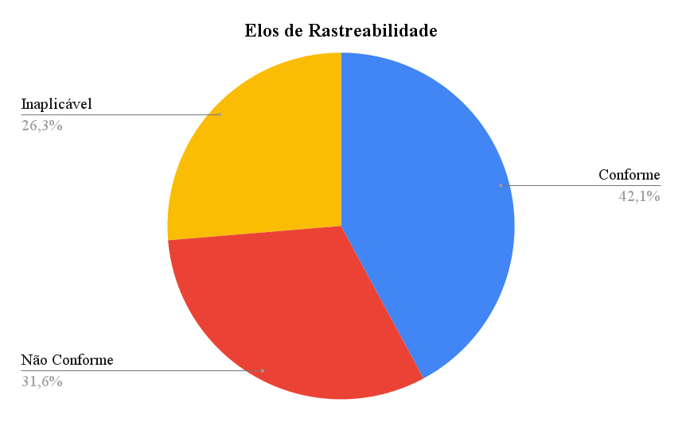

# Conformidade dos Artefatos

Esta página consolida a conformidade dos artefatos avaliados a partir das listas de verificação do projeto, destacando:

- Conforme (C)
- Não Conforme (NC)
- Inaplicável (NA)

## Como usar

1. Para cada lista de verificação do projeto, crie uma página nova copiando o arquivo “Modelo de Checklist” e preencha os itens.
2. Volte aqui e atualize a tabela de Sumário Global com os totais de cada lista.
3. Sempre que uma não conformidade for resolvida, atualize o status e a data.

## Legenda

- C: Conforme
- NC: Não Conforme
- NA: Inaplicável
- % Conformidade = C / (C + NC)

## Sumário Global

Preencha uma linha por lista de verificação:

| Lista                       | Itens | Aplicáveis (C+NC) |  C  | NC  | NA  | % Conformidade | Link                                                                                     |
| :-------------------------- | :---: | :---------------: | :-: | :-: | :-: | :------------: | :--------------------------------------------------------------------------------------- |
| Rich Picture                |   0   |         0         |  0  |  0  |  0  |       —        | [Ver detalhes]()                                                                         |
| Glossário                   |   0   |         0         |  0  |  0  |  0  |       —        | [Ver detalhes]()                                                                         |
| Análise de Documentos       |   0   |         0         |  0  |  0  |  0  |       —        | [Ver detalhes]()                                                                         |
| Entrevista                  |   0   |         0         |  0  |  0  |  0  |       —        | [Ver detalhes]()                                                                         |
| Observação                  |   0   |         0         |  0  |  0  |  0  |       —        | [Ver detalhes]()                                                                         |
| Perfil de usuário           |   0   |         0         |  0  |  0  |  0  |       —        | [Ver detalhes]()                                                                         |
| In or Out                   |   0   |         0         |  0  |  0  |  0  |       —        | [Ver detalhes]()                                                                         |
| MoSCoW                      |   0   |         0         |  0  |  0  |  0  |       —        | [Ver detalhes]()                                                                         |
| Pairwise Comparison         |   0   |         0         |  0  |  0  |  0  |       —        | [Ver detalhes]()                                                                         |
| Three Level Scale           |   0   |         0         |  0  |  0  |  0  |       —        | [Ver detalhes]()                                                                         |
| Cenários                    |   0   |         0         |  0  |  0  |  0  |       —        | [Ver detalhes]()                                                                         |
| Léxicos                     |   0   |         0         |  0  |  0  |  0  |       —        | [Ver detalhes]()                                                                         |
| Casos de Uso                |   0   |         0         |  0  |  0  |  0  |       —        | [Ver detalhes]()                                                                         |
| Especificação Suplementar   |   0   |         0         |  0  |  0  |  0  |       —        | [Ver detalhes]()                                                                         |
| Histórias de Usuário        |   0   |         0         |  0  |  0  |  0  |       —        | [Ver detalhes]()                                                                         |
| Backlogs                    |   0   |         0         |  0  |  0  |  0  |       —        | [Ver detalhes]()                                                                         |
| NFR Framework               |   0   |         0         |  0  |  0  |  0  |       —        | [Ver detalhes]()                                                                         |
| Elos de Pós-Rastreabilidade |  38   |        28         | 16  | 12  | 10  |      57,2      | [Ver detalhes](../../08_inspecao/entrega5/03_inspecao_elos_de_rastreabilidade_grupo2.md) |

## Gráficos

### Rich Picture

### Glossário

### Análise de Documentos

### Entrevista

### Observação

### Perfil de usuário

### In or Out

### MoSCoW

### Pairwise Comparison

### Three Level Scale

### Cenários

### Léxicos

### Casos de Uso

### Especificação Suplementar

### Histórias de Usuário

### Backlogs

### NFR Framework

### Elos de Rastreabilidade

## Histórico de versão

| Versão |    Data    | Descrição                                  | Autor(es) | Revisor |
| :----: | :--------: | :----------------------------------------- | :-------: | :-----: |
|  1.0   | 11/11/2025 | Criação inicial do documento de protótipos |  Samuel   | Thiago  |
