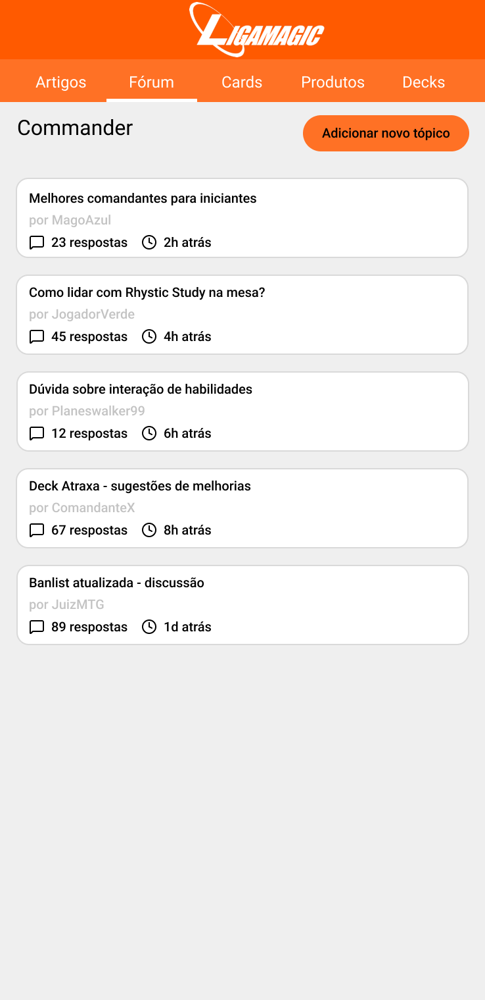
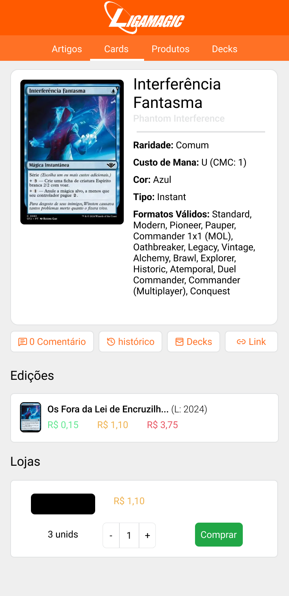
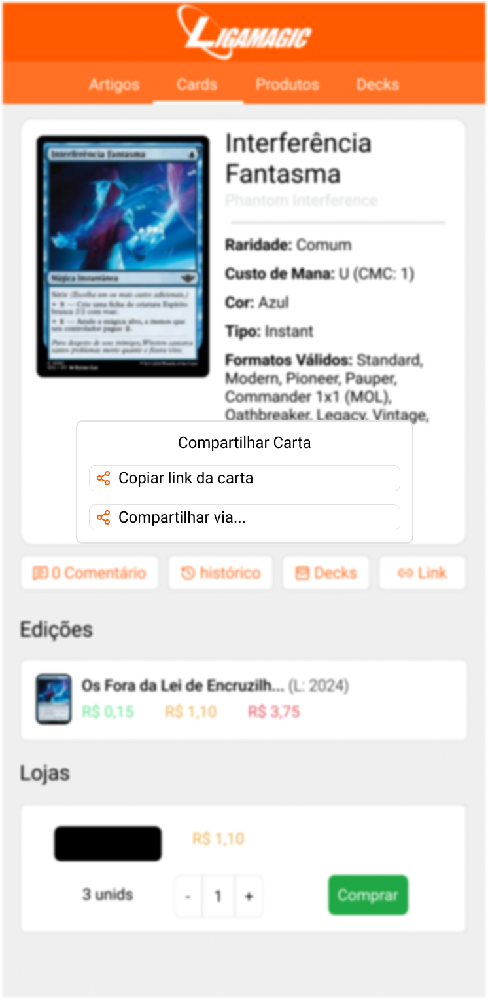
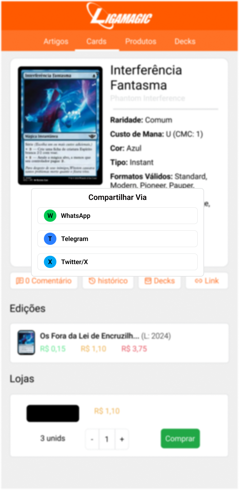
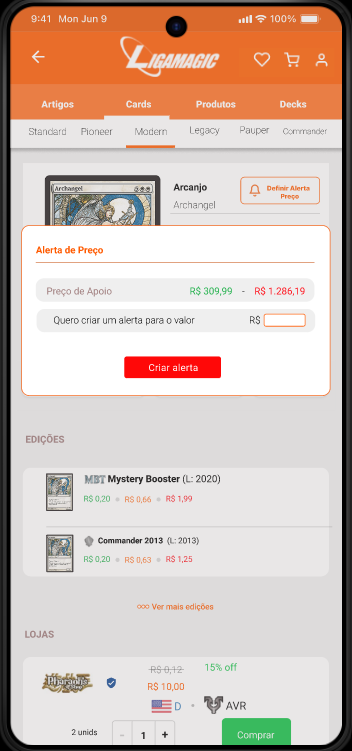
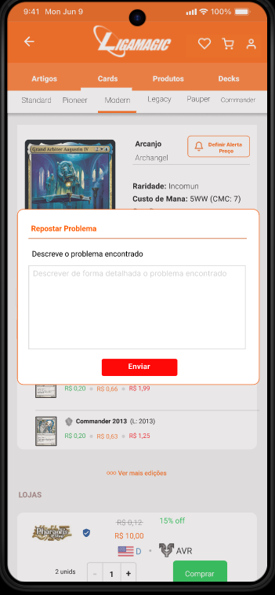

# Protótipos Desenvolvidos

## Descrição

Esta página apresenta todos os protótipos desenvolvidos para os requisitos funcionais não implementados no aplicativo LigaMagic. Os protótipos foram criados para demonstrar como as funcionalidades identificadas durante a elicitação de requisitos poderiam ser implementadas na aplicação.

## Objetivo

Apresentar de forma visual e organizada os protótipos criados para validar os requisitos funcionais não implementados, demonstrando a viabilidade e usabilidade das funcionalidades propostas através de interfaces de média/alta fidelidade.

## Metodologia

Os protótipos foram desenvolvidos utilizando a ferramenta Figma. Cada protótipo foi criado com base nos requisitos funcionais não implementados identificados durante o processo de elicitação, mantendo consistência visual com o aplicativo original LigaMagic.

A metodologia seguiu as seguintes etapas:

1. Análise dos requisitos funcionais não implementados
2. Criação de wireframes de baixa fidelidade
3. Desenvolvimento dos protótipos de média/alta fidelidade
4. Validação com usuários através de gravações
5. Refinamento baseado no feedback coletado

## Conteúdo

### Protótipos por Requisito

|    ID              | Requisito não implementado  | Descrição do Requisito                                                                                                        |           Técnica de Elicitação                        |                     Requisito Original                           | PDF/Figma                                                                                                                                                                                                                                                              |   Autor   |
|:------------------:|:---------------------------:|:------------------------------------------------------------------------------------------------------------------------------|:------------------------------------------------------:|:----------------------------------------------------------------:|------------------------------------------------------------------------------------------------------------------------------------------------------------------------------------------------------------------------------------------------------------------------|:---------:|
| [01](#prototipo01) |           RFNI02           | O sistema deve possibilitar participação dos usuários em fóruns de discussão (postagem e resposta)                            |     [AD11](../tecnicas/analise_documentos.md#ad11)     |             [RF11](./requisitos_elicitados.md#rf11)              |                                                                                                                                                                                                                                                     [PDF](../../00_assets/pdfs/prototipo/figma_mensagens_no_forum.pdf) [Figma](https://www.figma.com/design/8FgbjaBilslE53fXCJpUfO/RS---F%C3%B3rum?node-id=0-1&t=Q1BS2TESh2QyVHNb-1)                |  Samuel   |
| [02](#prototipo02) |           RFNI06           | Permitir que o usuário compartilhe informações da carta por link direto                                                       |        [OBS17](../tecnicas/observacao.md#obs17)        |             [RF36](./requisitos_elicitados.md#rf36)              |                                                                                                                                                                                                                                                          [PDF](../../00_assets/pdfs/prototipo/figma_compartilhar_carta.pdf) [Figma](https://www.figma.com/design/u4Y4vt2gc6v10iv7uORAL7/RS---LINK?t=DEG9MJrItPpocFnt-1)           |  Samuel   |
| [03](#prototipo03) |           RFNI14            | Permitir que o usuário salve cartas para compra futura (wishlist)                                                             | [OBS09](../03_elicitacao/tecnicas/observacao.md#obs09) | [RF28](../03_elicitacao/artefatos/requisitos_elicitados.md#rf28) |                                                                                                                                                                                                                                                                        | Angélica  |
| [04](#prototipo04) |           RFNI16            | O sistema deve permitir que o usuário compare cartas lado a lado (atributos, valores e edições)                               | [OBS13](../03_elicitacao/tecnicas/observacao.md#obs13) | [RF20](../03_elicitacao/artefatos/requisitos_elicitados.md#rf32) |                                                                                                                                                                                                                                                                        | Angélica  |
| [05](#prototipo05) |           RFNI17            | O sistema deve permitir que o usuário receba recomendações automáticas de cartas com base em suas buscas e compras anteriores |  [AD17](../03_elicitacao/tecnicas/observacao.md#ad17)  | [RF17](../03_elicitacao/artefatos/requisitos_elicitados.md#rf17) |                                                                                                                                                                                                                                                                        | Angélica  |
| [06](#prototipo06) |       RFNI08 e RFNI14       | O sistema deve fornecer um módulo completo de leilões e permitir que o usuário salve cartas para compra futura (wishlist)     | [OBS09](../03_elicitacao/tecnicas/observacao.md#obs09) | [RF28](../03_elicitacao/artefatos/requisitos_elicitados.md#rf28) |                                                                                                                                                                                                                                                                        | Guilherme |
| [07](#prototipo07) |           RFNI04            | Permitir que o usuário avalie ou dê feedback sobre vendedores ou decks                                                        | [OBS10](../03_elicitacao/tecnicas/observacao.md#obs10) | [RF29](../03_elicitacao/artefatos/requisitos_elicitados.md#rf29) |                                                                                                                                                                                                                                                                        |  Thiago   |
| [08](#prototipo08) |           RFNI10            | Os usuários devem ser capazes de catalogar e gerenciar sua coleção pessoal de cartas                                          |  [EN01](../03_elicitacao/tecnicas/entrevista.md#en01)  | [RF38](../03_elicitacao/artefatos/requisitos_elicitados.md#rf38) |                                                                                                                                                                                                                                                                        |  Thiago   |
| [09](#prototipo09) |           RFNI05            | Permitir que o usuário defina um alerta de preço para a carta selecionada                                                     |     [OBS12](../03_elicitacao/observacao.md#obs12)      |             [RF31](./requisitos_elicitados.md#rf31)              | [PDF](../../../00_assets/pdfs/prototipo/PrototipoVera_01.pdf) [Figma](https://www.figma.com/proto/UTTZOad6C9ctSx5MVubLzW/Sem-t%C3%ADtulo?node-id=2-2&p=f&t=LDfQntxofExZ0W4M-0&scaling=scale-down&content-scaling=fixed&page-id=0%3A1&starting-point-node-id=2%3A2) |   Vera    |
| [10](#prototipo10) |           RFNI07            | Permitir que o usuário reporte problemas relacionados à carta (erros de informação, anúncios suspeitos, etc.)                 |     [OBS18](../03_elicitacao/observacao.md#obs18)      |             [RF37](./requisitos_elicitados.md#rf37)              | [PDF](../../../00_assets/pdfs/prototipo/prototipoVera_02.pdf) [Figma](https://www.figma.com/proto/UTTZOad6C9ctSx5MVubLzW/Sem-t%C3%ADtulo?node-id=2-2&p=f&t=LDfQntxofExZ0W4M-0&scaling=scale-down&content-scaling=fixed&page-id=0%3A1&starting-point-node-id=2%3A2) |   Vera    |
 | [10](#prototipo10) |           RFNI01            | permitir que cada usuário personalize e mantenha sua página pessoal/profissional                                              |  [AD10](../03_elicitacao/tecnicas/observacao.md#ad10)  |             [RF10](./requisitos_elicitados.md#rf10)              | [PDF](../../../00_assets/pdfs/prototipo/prototipaçãodepersonalizaçãodeperfildeusuário.pdf) [Figma](https://www.figma.com/design/uPVQ3qelnG2LbQjussehuw/prototipa%C3%A7%C3%A3o-personalizar-perfil-de-usu%C3%A1rio?node-id=0-1&p=f&t=ouk8UWAqesbXmO8y-0)            |   Marcelo |
 | [11](#prototipo11) |           RFNI03            | permitir que cada usuário personalize e mantenha sua página pessoal/profissional                                              |     [OBS02](../03_elicitacao/observacao.md#obs02)      |           [RF21.2](./requisitos_elicitados.md#rf21.2)            | [PDF](../../../00_assets/pdfs/prototipo/prototipaçãodefiltragemporqualidadacondição.pdf) [Figma](https://www.figma.com/design/BOpz8yQkgiupHVaMkERla2/prototipa%C3%A7%C3%A3o-de-filtragem-por-qualidada-condi%C3%A7%C3%A3o?node-id=0-1&p=f&t=RanOX0VkhUqlfIkx-0)    |   Marcelo |

<strong>Tabela 1:</strong> Protótipos desenvolvidos por requisito

**Fonte:** Samuel, 2025.

### Imagens dos Protótipos

#### Protótipo 01: Deve permitir envio e respostas a mensagens no fórum (RFNI02) {#prototipo01}

**Fonte:** Samuel, 2025.

**Fonte:** Samuel, 2025.

**Fonte:** Samuel, 2025.

#### Protótipo 02: Compartilhar carta (RFNI06) {#prototipo02}

**Fonte:** Samuel, 2025.

**Fonte:** Samuel, 2025.

**Fonte:** Samuel, 2025.

#### Protótipo 03: Wishlist de Cartas (RFNI14) {#prototipo03}

**Fonte:** Angélica, 2025.

### Protótipo 04: Comparação de Cartas (RFNI16) {#prototipo04}

**Fonte:** Angélica, 2025.

### Protótipo 05: Recomendações Automáticas (RFNI17) {#prototipo05}

**Fonte:** Angélica, 2025.

### Protótipo 06: 

<iframe style="border: 1px solid rgba(0, 0, 0, 0.1);" width="800" height="450" src="https://embed.figma.com/proto/ETld5LmfnNpxRtooYAO3Ie/Ligamagic?node-id=7-91&starting-point-node-id=1%3A2&embed-host=share" allowfullscreen></iframe>

#### Protótipo 07: Avaliação de vendedores (RFNI04) {#prototipo07}

**Fonte:** Thiago, 2025.

**Fonte:** Thiago, 2025.

#### Protótipo 08: Catalogar coleção pessoal de cartas (RFNI10) {#prototipo08}

**Fonte:** Thiago, 2025.

**Fonte:** Thiago, 2025.

**Fonte:** Thiago, 2025.

**Fonte:** Thiago, 2025.

#### Protótipo 09: Alerta de preço para uma carta selecionada (RFNI05) {#prototipo09}

  

    
  

  

    
  

**Fonte:** Vera, 2025

#### Protótipo 10: Reportar problemas relacionados à carta (erros de informação, anúncios suspeitos, etc.)(RFNI07) {#prototipo10}

  

    
  

  

    
  

**Fonte:** Vera, 2025

### Protótipo 11: personalizar perfil de usuário

<iframe style="border: 1px solid rgba(0, 0, 0, 0.1);" width="800" height="450" src="https://embed.figma.com/proto/uPVQ3qelnG2LbQjussehuw/prototipa%C3%A7%C3%A3o-personalizar-perfil-de-usu%C3%A1rio?node-id=19-12&p=f&scaling=scale-down&content-scaling=fixed&page-id=0%3A1&starting-point-node-id=19%3A12&embed-host=share" allowfullscreen></iframe>

**Fonte:** Marcelo, 2025

### Protótipo 12: Filtrar carta por qualidade/condição

<iframe style="border: 1px solid rgba(0, 0, 0, 0.1);" width="800" height="450" src="https://embed.figma.com/proto/BOpz8yQkgiupHVaMkERla2/prototipa%C3%A7%C3%A3o-de-filtragem-por-qualidada-condi%C3%A7%C3%A3o?node-id=4-730&p=f&scaling=scale-down&content-scaling=fixed&page-id=0%3A1&starting-point-node-id=4%3A730&embed-host=share" allowfullscreen></iframe>

**Fonte:** Marcelo, 2025

### Validação dos Protótipos

Os protótipos foram validados através de sessões com usuários do LigaMagic, onde foi coletado feedback sobre a usabilidade e adequação das interfaces propostas. As gravações das validações estão disponíveis para consulta e análise.

- [Assista ao vídeo no YouTube a validação do prototipo dos requisitos RFNI14, RFNI16 e RFNI17](https://youtu.be/5QJS0GAnPRo). Este video foi produzido pela aluna Angélica Campos. 

## Agradecimentos

O Grupo 02 agradece o apoio das ferramentas de Inteligência Artificial Generativa — ChatGPT e Google Gemini — na revisão e padronização de nossos artefatos. Essas tecnologias foram utilizadas para auxiliar na organização do repositório. Todo o conteúdo, incluindo a precisão técnica e as ideias apresentadas, é de responsabilidade dos autores.

## Nível de Contribuição dos Integrantes

| Nome      | % de Contribuição |
| :-------- | :---------------: |
| Samuel    |      14,28%       |
| Thiago    |      14,28%       |
| Angélica  |      14,28%       |
| Vera      |      14,28%       |
| Marcelo   |      14,28%       |
| Raissa    |      14,28%       |
| Guilherme |      14,28%       |

## Histórico de versão

| Versão |    Data    | Descrição                                  | Autor(es) | Revisor  |
| :----: | :--------: | :----------------------------------------- | :-------: | :------: |
|  1.0   | 07/11/2025 | Criação inicial do documento de protótipos |  Samuel   | Angélica |
|  1.1   | 10/11/2025 | Protótipo 06                               | Guilherme |   Vera   |
|  1.2   | 10/11/2025 | Protótipo 07 e 08                          |  Thiago   |  Samuel  |
|  1.3   | 11/11/2025 | Protótipo 9 e 10                           |   Vera    |  Samuel  |
|  1.4   | 12/11/2025 | Arrumando as imagens                       |  Thiago   |  Samuel  |
|  1.5   | 11/11/2025 | Protótipo 11 e 12                          |   Vera    |  Samuel  |
|  1.3   | 11/11/2025 | Protótipo 14, 16 e 17                 |  Angélica  | Raissa |
