# Conformidade dos Artefatos

Esta página consolida a conformidade dos artefatos avaliados a partir das listas de verificação do projeto, destacando:

- Conforme (C)
- Não Conforme (NC)
- Inaplicável (NA)

## Como usar

1. Para cada lista de verificação do projeto, crie uma página nova copiando o arquivo “Modelo de Checklist” e preencha os itens.
2. Volte aqui e atualize a tabela de Sumário Global com os totais de cada lista.
3. Sempre que uma não conformidade for resolvida, atualize o status e a data.

## Legenda

- C: Conforme
- NC: Não Conforme
- NA: Inaplicável
- % Conformidade = C / (C + NC)

## Sumário Global

Preencha uma linha por lista de verificação:

| Lista                     | Itens | Aplicáveis (C+NC) |  C  | NC  | NA  | % Conformidade | Link                                                                                                    |
| :------------------------ | :---: | :---------------: | :-: | :-: | :-: | :------------: | :------------------------------------------------------------------------------------------------------ |
| Rich Picture              |  21   |        20         | 19  |  1  |  1  |      95,0      | [Ver detalhes](../lista_de_verificacao/calendario/entrega1/verificacao_rich_picture.md)                 |
| Glossário                 |  29   |        22         | 18  |  4  |  7  |      81,8      | [Ver detalhes](../lista_de_verificacao/calendario/entrega2/01_verificacao_glossario.md)                 |
| Análise de Documentos     |  10   |         9         |  9  |  0  |  1  |     100,0      | [Ver detalhes](../lista_de_verificacao/calendario/entrega2/02_verificacao_analise_de_documentos.md)     |
| Entrevista                |   9   |         9         |  9  |  0  |  0  |     100,0      | [Ver detalhes](../lista_de_verificacao/calendario/entrega2/03_verificacao_entrevista.md)                |
| Observação                |  18   |        18         | 16  |  2  |  0  |      88,9      | [Ver detalhes](../lista_de_verificacao/calendario/entrega2/04_verificacao_observacao.md)                |
| Perfil de usuário         |  10   |        10         | 10  |  0  |  0  |     100,0      | [Ver detalhes](../lista_de_verificacao/calendario/entrega2/05_verificacao_perfil_de_usuario.md)         |
| In or Out                 |   9   |         8         |  7  |  1  |  1  |      87,5      | [Ver detalhes](../lista_de_verificacao/calendario/entrega2/06_verificacao_in_or_out.md)                 |
| MoSCoW                    |  12   |        10         | 10  |  0  |  2  |     100,0      | [Ver detalhes](../lista_de_verificacao/calendario/entrega2/07_verificacao_moscow.md)                    |
| Pairwise Comparison       |  10   |         9         |  9  |  0  |  1  |     100,0      | [Ver detalhes](../lista_de_verificacao/calendario/entrega2/08_verificacao_pairwise_comparison.md)       |
| Three Level Scale         |  13   |        11         | 10  |  1  |  2  |      90,9      | [Ver detalhes](../lista_de_verificacao/calendario/entrega2/09_verificacao_three_level_scale.md)         |
| Cenários                  |  10   |        10         | 10  |  0  |  0  |     100,0      | [Ver detalhes](../lista_de_verificacao/calendario/entrega3/01_verificacao_cenarios.md)                  |
| Léxicos                   |  13   |        13         | 11  |  2  |  0  |      84,6      | [Ver detalhes](../lista_de_verificacao/calendario/entrega3/02_verificacao_lexicos.md)                   |
| Casos de Uso              |  19   |        19         | 19  |  0  |  0  |     100,0      | [Ver detalhes](../lista_de_verificacao/calendario/entrega3/03_verificacao_casos_de_uso.md)              |
| Especificação Suplementar |  12   |         7         |  4  |  3  |  5  |      57,1      | [Ver detalhes](../lista_de_verificacao/calendario/entrega3/04_verificacao_especificacao_suplementar.md) |
| Histórias de Usuário      |  30   |        22         | 22  |  0  |  8  |      100       | [Ver detalhes](../lista_de_verificacao/calendario/entrega4/01_verificacao_historias_de_usuario.md)      |
| Backlogs                  |  16   |        10         | 10  |  0  |  6  |      100       | [Ver detalhes](../lista_de_verificacao/calendario/entrega4/02_verificacao_backlogs.md)                  |
| NFR Framework             |  32   |        32         | 12  | 20  |  0  |      37,5      | [Ver detalhes](../lista_de_verificacao/calendario/entrega4/03_verificacao_nfr_framework.md)             |
| Elos de Rastreabilidade   |  38   |        28         | 16  | 12  | 10  |      57,2      | [Ver detalhes](../lista_de_verificacao/calendario/entrega5/verificacao_elos_de_rastreabilidade.md)      |

## Gráficos

### Rich Picture

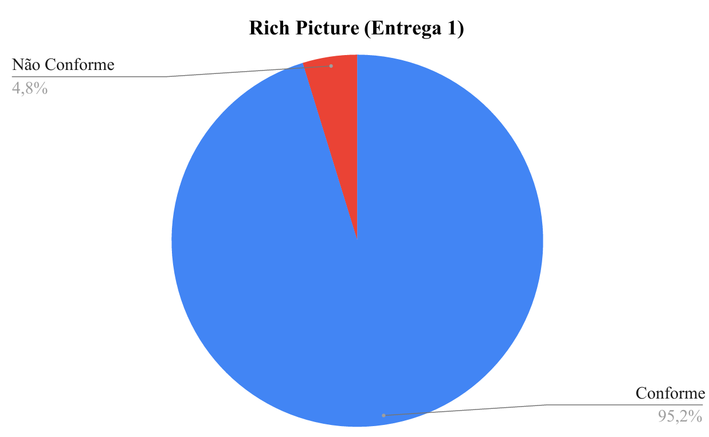

### Glossário

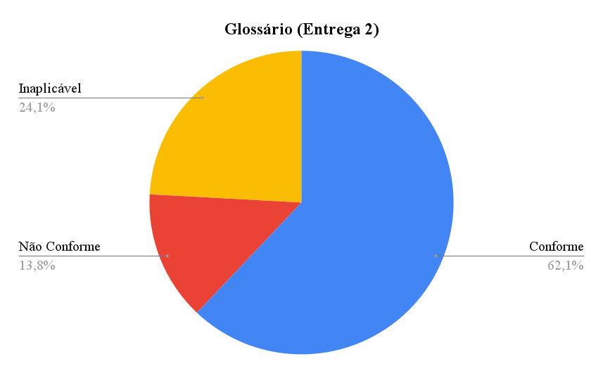

### Análise de Documentos

### Entrevista

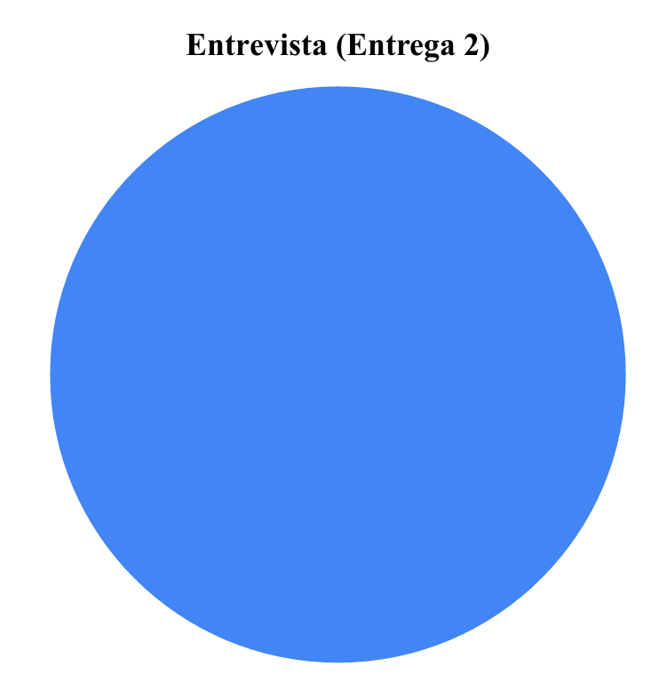

### Observação

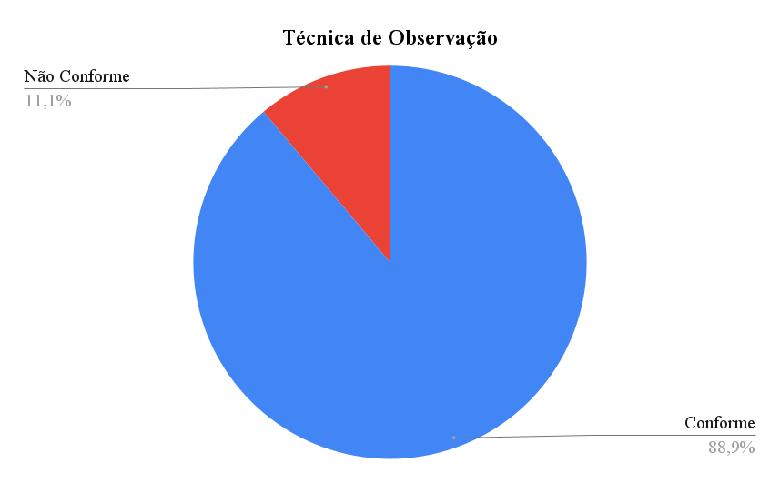

### Perfil de usuário

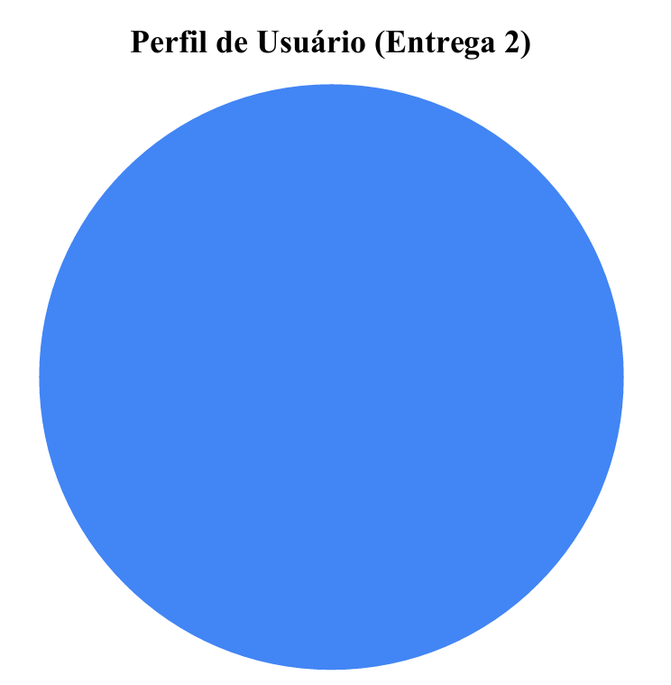

### In or Out

### MoSCoW

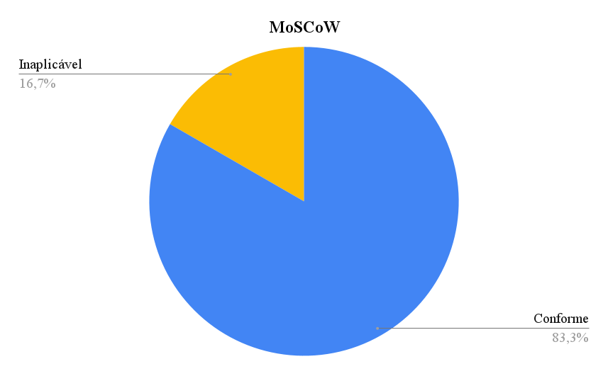

### Pairwise Comparison

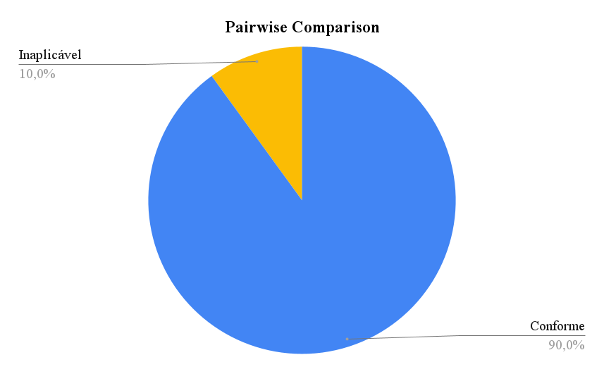

### Three Level Scale

### Cenários

### Léxicos

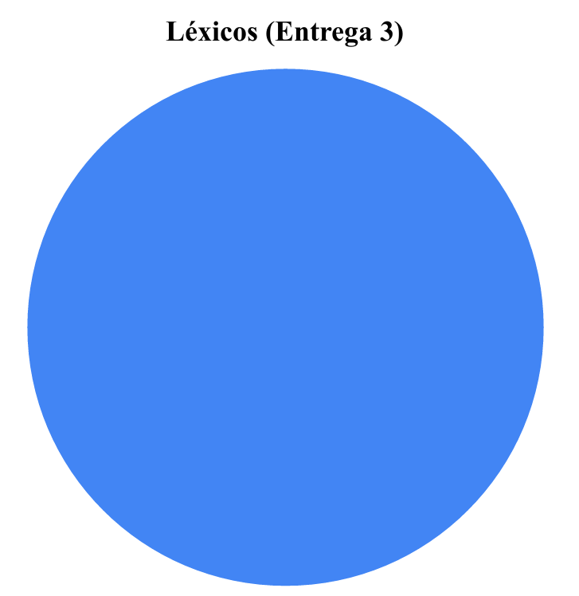

### Casos de Uso

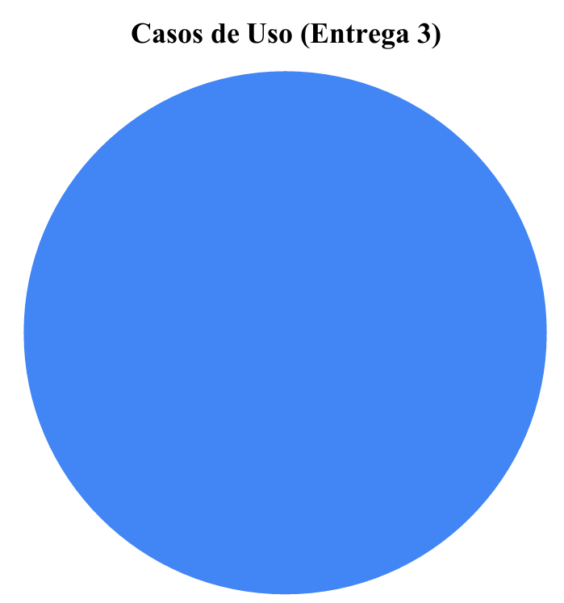

### Especificação Suplementar

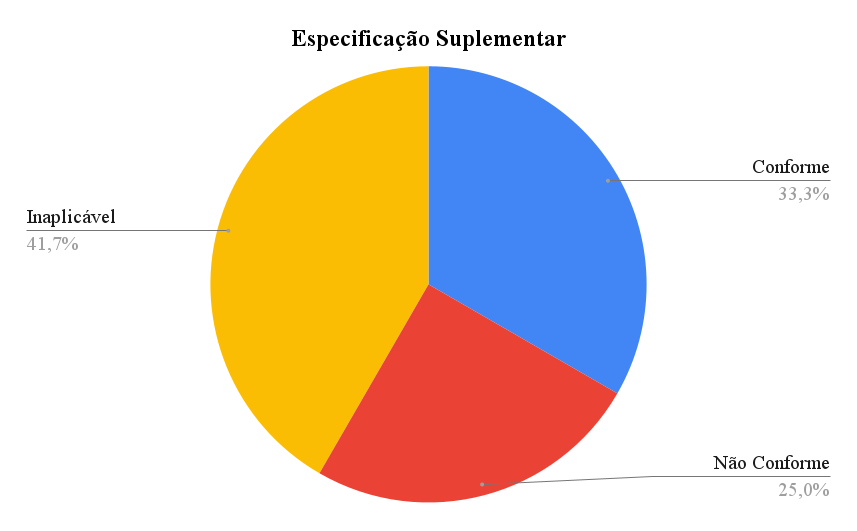

### Histórias de Usuário

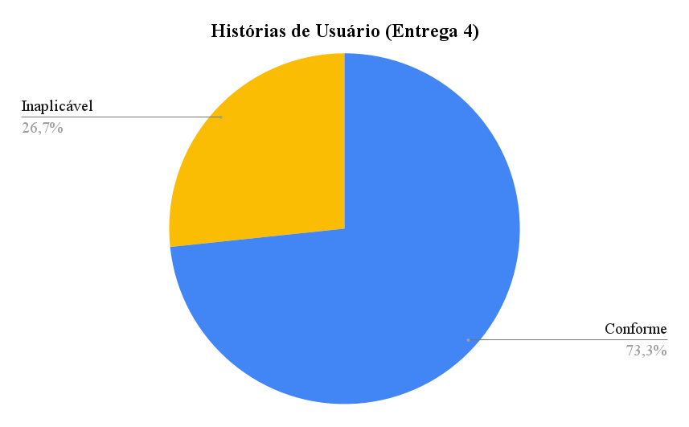

### Backlogs

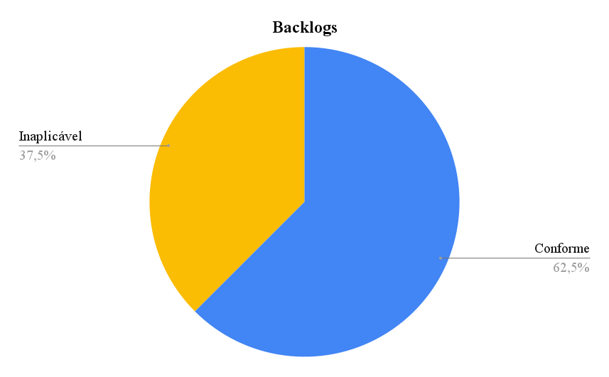

### NFR Framework

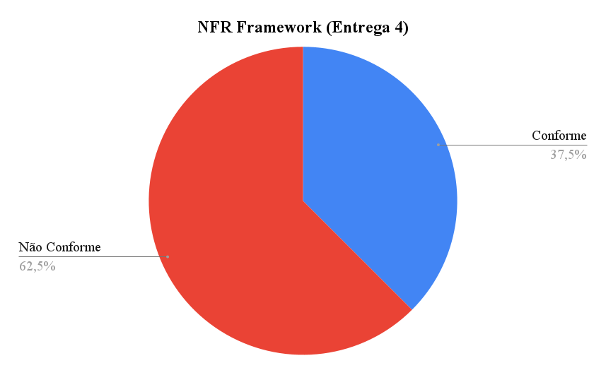

### Elos de Rastreabilidade

## Agradecimentos

O Grupo 02 agradece o apoio das ferramentas de Inteligência Artificial Generativa — ChatGPT e Google Gemini — na revisão e padronização de nossos artefatos. Essas tecnologias foram utilizadas para auxiliar na organização do repositório. Todo o conteúdo, incluindo a precisão técnica e as ideias apresentadas, é de responsabilidade dos autores.

## Vídeo no Youtube
- [Assista ao vídeo no YouTube](https://youtu.be/7IXuy75DZDI?t=1) Este vídeo foi produzido pelo grupo todo, serve como apresentação, entre os minutos 00:00 e 3:39 apresentamos as conformidades do nosso grupo com as nossas listas de verificação.

## Histórico de versão

| Versão |    Data    | Descrição                                              | Autor(es) | Revisor |
| :----: | :--------: | :----------------------------------------------------- | :-------: | :-----: |
|  1.0   | 11/11/2025 | Criação inicial do documento de protótipos             |  Samuel   | Thiago  |
|  1.1   | 12/11/2025 | Adição dos resultados e gráficos das entregas 1, 2 e 3 |  Thiago   | Samuel  |
|  1.1   | 12/11/2025 | Adição dos resultados e gráficos das entregas 4 e 5    |  Samuel   | Thiago  |
|  1.2   | 19/11/2025 | Arrumando os Gráficos incorretos e adição do vídeo do youtube    |  Thiago   | Samuel  |
