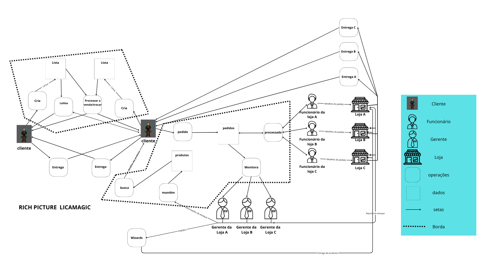

# Rich Picture

## O que é um Rich Picture?

Um **Rich Picture**  é uma ferramenta de brainstorming visual, utilizada para explorar, entender e definir situações problemáticas complexas e "bagunçadas", especialmente aquelas que envolvem pessoas, processos e tecnologia. Ele não é um diagrama técnico com regras rígidas, mas sim um desenho livre, quase como uma charge ou um mapa mental, que busca capturar a essência da situação.

Ao criar um Rich Picture, o objetivo é representar visualmente todos os elementos importantes de um problema e suas interconexões. Isso ajuda a identificar pontos de vista diferentes e a revelar questões que poderiam passar despercebidas em uma análise puramente textual. Um bom Rich Picture ajuda a identificar:

1.  **A Estrutura e os Processos:** Quais são as principais atividades de negócio, fluxos de trabalho e os dados essenciais que eles utilizam.
2.  **Os Atores e Stakeholders:** Quem são as pessoas, grupos ou sistemas envolvidos (clientes, funcionários, gerentes) e quais são seus papéis e responsabilidades.
3.  **As Relações e Conexões:** Como os diferentes processos, atores e dados se conectam e interagem entre si.
4.  **Os "Problemas" e Conflitos:** Quais são as tensões, problemas, preocupações, conflitos e possíveis pontos de melhoria na situação. É comum usar símbolos como "nuvens de tempestade" para representar conflitos ou "lâmpadas" para ideias.

## Rich Picture do projeto

  <strong>Figura 1: Rich Picture ligamagic (Fonte: Autor, 2025)</strong>

##Legenda
Componentes do Rich Picture.

  <strong>Figura 2:  Legenda do Rich Picture ligamagic (Fonte: Autor, 2025)</strong>

## Referências

* Introducing Rich Pictures - Rich Picture Drawing Guidelines (Diretrizes para desenhar Rich Pictures). Aprender3. Disponível em: <https://aprender3.unb.br/pluginfile.php/3210571/mod_resource/content/2/1_5145791542719414573.pdf>. Acesso em: 27 set. 2025.

## Histórico de versão

| Versão |    Data    |                   Descrição                   | Autor(es) | Revisor(es) |
|:------:|:----------:|:---------------------------------------------:|:---------:|:-----------:|
|  1.0   | 09/09/2025 |              Rich Picture ligamagic           |  Marcelo  |  Guilherme  |

