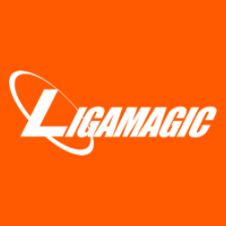

# Grupo 2 - LigaMagic

Este espaço reúne toda a documentação referente ao processo de levantamento do grupo 2 na disciplina de Requisitos de Software da Faculdade de Ciências e Tecnologias em Engenharia - Campus UnB Gama durante o 2º semestre de 2025, análise e especificação de requisitos da comunidade escolhida:

Figura 1: Logo da LigaMagic

  

Fonte: [LigaMagic](https://www.ligamagic.com.br/?view=home)

O site LigaMagic é a plataforma central e o ecossistema definitivo para a comunidade de
Magic: The Gathering (MTG) no Brasil. Ele transcende a função de um simples e-commerce para atuar como o principal marketplace, um hub de conteúdo estratégico e o fórum de discussão mais influente para jogadores, colecionadores e lojistas em todo o país. Sua proposta de valor é consolidar "Tudo sobre Magic: The Gathering", incluindo negociações, torneios, notícias, lançamentos, discussões e os melhores preços em um único local.

A plataforma funciona primariamente como um agregador, conectando o inventário de inúmeras lojas físicas e online a uma base de consumidores nacional. Além disso, oferece um espaço para transações diretas entre jogadores, leilões de itens raros e um robusto banco de dados de cartas e decks que serve como a referência de precificação para todo o mercado brasileiro.

## Objetivo do Projeto

O objetivo é aplicar os conceitos de Engenharia de Requisitos usando a comunidade LigaMagic.

## Grupo 02

### Integrantes

<table>
  <tr>
    <td align="center"><a href="https://github.com/angelicaccampos"> <b>ANGELICA DA COSTA CAMPOS</b></a> 
    <td align="center"><a href="https://github.com/GuilhermeOliveira1327"> <b>GUILHERME OLIVEIRA</b></a> 
    <td align="center"><a href="https://github.com/MatielloAL"> <b>MARCELO DE ARAUJO LOPES</b></a> 
    <td align="center"><a href="https://github.com/RaissaAndradeS"> <b>RAISSA ANDRADE SILVEIRA</b></a> 
    <td align="center"><a href="https://github.com/samuelncaetano"> <b>SAMUEL NOGUEIRA CAETANO</b></a> 
    <td align="center"><a href="https://github.com/Acciolyy"> <b>THIAGO VIRIATO ACCIOLY</b></a> 
    <td align="center"><a href="https://github.com/verabelucia"> <b>VERA LUCIA BEZERRA DA SILVA</b></a> 
  </tr>
</table>

## Histórico de versão

| Versão |    Data    | Descrição                                     |     Autor(es)     | Revisor(es) |
| :----: | :--------: | :-------------------------------------------- | :---------------: | :---------: |
|  1.0   | 04/09/2025 | Criação da git page                           |      Samuel       |  Angélica   |
|  1.1   | 06/09/2025 | Adição da intro, Objetivo e logo da LigaMagic |     Angélica      |        Raissa     |
|  1.2   | 09/09/2025 | Adicionar a opção de contraste de cores       | Samuel, Guilherme |     Raissa        |
