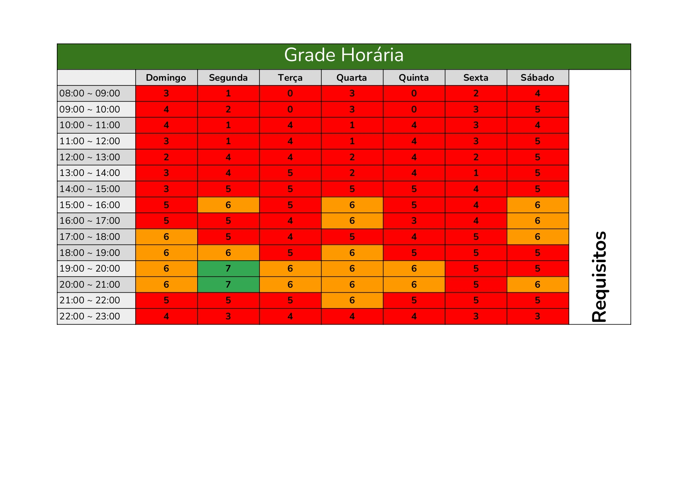

# Heatmap de Disponibilidade dos Integrantes

## Introdução
Este documento apresenta o **Heatmap de disponibilidade da equipe**, utilizado para planejar as atividades do projeto e a alocação de tarefas do grupo 2 da disciplina de Requisitos de Software. Este heatmap foi adaptado a partir de materiais de outra matéria, sem referência oficial disponível.

## Objetivo

O Heatmap tem como objetivo:  

- Visualizar a disponibilidade de cada integrante da equipe.  
- Auxiliar na definição de responsáveis por atividades do projeto.  
- Facilitar o planejamento de gravações e entregas.  

## Estrutura do Heatmap

[Visualizar PDF dos Horários Gerais](horarios_gerais.pdf)

## Histórico de versão
| Versão | Data | Descrição | Autor(es)	 | Revisor(es)	 |
|:--:|:------------:|:-----------:|:----:| :----:|
|  1.0  |       05/09/2025       |       Criação da Documentação	      |   Angélica   |   Thiago   |
|  1.1  |       09/09/2025       |       Adicinou o jpg do heatmap e introdução	      |   Angélica   |   Thiago   |